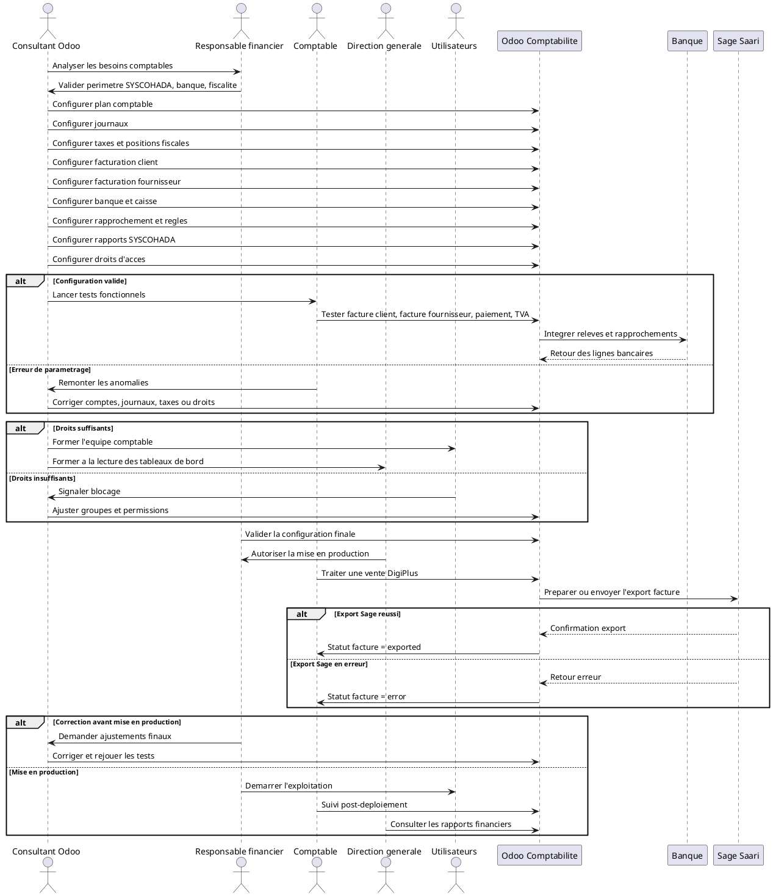

# Configuration Comptable Complete dans Odoo 18 pour DigiPlus Consulting

## 1. Introduction

Le module Comptabilite est le centre de consolidation financiere d'Odoo. Il recoit les donnees issues des ventes, des factures clients, des achats, des factures fournisseurs, des paiements, des banques, des notes de frais, du stock, de la paie et des ecritures diverses.

Dans DigiPlus, ce module doit soutenir une activite de services digitaux, consulting, ERP, CRM, developpement web, formation, support technique et licences Microsoft 365. Il doit aussi rester coherent avec une logique SYSCOHADA et avec le suivi d'export vers Sage Saari deja visible dans l'environnement sur les factures clients.

Une bonne configuration comptable est indispensable avant l'exploitation reelle. Si le plan comptable, les journaux, les taxes, les comptes tiers ou les droits d'acces sont mal parametres, tout le reste devient fragile : factures, paiements, rapprochements, TVA, rapports et exports.

Dans le depot actuel :

- le module `digiplus_agrochem_demo` depend deja de `account` ;
- les factures clients disposent deja des champs `x_sage_saari_export_status`, `x_sage_saari_reference` et `x_integration_comment` ;
- le menu `Facturation & Sage Saari` expose deja les factures clients pour le suivi operationnel ;
- les dashboards `Pilotage executif` et `Reporting & BI` peuvent servir de base pour les KPI financiers ;
- les modules dedies Notes de frais et Paie ne sont pas personnalises ici, mais doivent etre prevus dans la configuration cible si DigiPlus veut alimenter la comptabilite depuis ces flux.

## 2. Position du module Comptabilite dans le workflow global

Le positionnement fonctionnel est le suivant :

```text
Ventes
-> Factures clients
-> Comptabilite

Achats
-> Factures fournisseurs
-> Comptabilite

Banque
-> Paiements et releves
-> Comptabilite

Notes de frais
-> Depenses validees
-> Comptabilite

Paie
-> Ecritures de salaires
-> Comptabilite

Stock
-> Valorisation si activee
-> Comptabilite

Comptabilite
-> Etats financiers
-> Rapports
-> Export Sage Saari si necessaire
```

Lecture pratique :

- la `vente` cree le chiffre d'affaires et la creance client ;
- l'`achat` cree la dette fournisseur et les charges ;
- la `banque` confirme les encaissements et decaissements reels ;
- les `notes de frais` et la `paie` alimentent les charges ;
- le `stock` alimente la valorisation et les couts si la comptabilisation automatique est activee ;
- la `comptabilite` centralise tout cela pour produire des ecritures, des soldes et des rapports.

## 3. Objectifs de la configuration comptable

La configuration sert a :

- structurer le plan comptable ;
- definir les journaux ;
- configurer les taxes ;
- parametrer les comptes clients et fournisseurs ;
- parametrer la facturation client ;
- parametrer la facturation fournisseur ;
- configurer les comptes bancaires ;
- preparer le rapprochement bancaire ;
- configurer les comptes analytiques ;
- gerer les droits d'acces ;
- preparer les etats financiers ;
- securiser l'export Sage Saari.

En pratique, chaque parametre doit repondre a une question metier claire :

- ou va l'ecriture ;
- qui peut la creer ou la valider ;
- comment elle sera payee ou rapprochee ;
- dans quel rapport elle remontera ;
- comment elle sera controlee avant export.

## 4. Configuration du plan comptable SYSCOHADA

**Acteurs principaux**  
Consultant Odoo, responsable financier, comptable senior

**Ecran Odoo**  
`Comptabilite -> Configuration -> Plan comptable`

**Principe**

La documentation Odoo 18 indique que le pays choisi a la creation de la base ou de la societe determine la localisation fiscale installee par defaut et le plan comptable standard associe. Pour DigiPlus, cela signifie qu'il faut d'abord verifier la localisation disponible pour le pays cible, puis la completer ou l'ajuster pour obtenir une structure compatible SYSCOHADA.

Le SYSCOHADA retient neuf classes de comptes :

- classes `1 a 5` : comptes de bilan ;
- classes `6 et 7` : charges et produits des activites ordinaires ;
- classe `8` : autres charges et autres produits ;
- classe `9` : comptabilite des engagements et comptabilite analytique de gestion.

### 4.1 Demarche de parametrage

1. Charger la localisation fiscale disponible pour la societe.
2. Verifier la presence ou non d'un plan de comptes compatible avec l'usage local.
3. Completer les comptes manquants pour SYSCOHADA.
4. Verifier les proprietes critiques de chaque compte :
   `code`, `nom`, `type`, `groupe`, `autoriser le lettrage`, `taxes par defaut`, `obsolete`.
5. Bloquer toute mise en production tant que la correspondance entre operations et comptes n'est pas validee.

### 4.2 Comptes a creer ou verifier

| Type de compte | Role | Utilisation principale | Module qui l'alimente | Risque si mal configure |
|---|---|---|---|---|
| Comptes clients | Porter les creances clients | Factures clients, paiements, lettrage | Vente, Facturation, Banque | Balance agee fausse, recouvrement brouille |
| Comptes fournisseurs | Porter les dettes fournisseurs | Factures fournisseurs, paiements | Achats, Comptabilite, Banque | Dettes fausses, echeances mal suivies |
| Comptes de produits | Enregistrer le chiffre d'affaires | Lignes de factures clients | Vente, Facturation | Revenu mal ventile, reporting faux |
| Comptes de charges | Enregistrer les couts | Factures fournisseurs, notes de frais, OD | Achats, Expenses, Comptabilite | Rentabilite et resultat fausses |
| Comptes de TVA collectee | Enregistrer la TVA sur ventes | Factures clients | Facturation | Declaration TVA incorrecte |
| Comptes de TVA deductible | Enregistrer la TVA sur achats | Factures fournisseurs, frais | Achats, Expenses | TVA recuperable mal calculee |
| Comptes bancaires | Porter les soldes de banque | Paiements, releves, rapprochements | Banque | Tresorerie fausse |
| Comptes de caisse | Porter l'espece | Paiements cash, petite caisse | Banque, Caisse | Solde caisse non fiable |
| Comptes d'attente | Isoler les flux en attente | Import bancaire, ecritures temporaires | Banque, Comptabilite | Ecritures non soldes et ecarts caches |
| Comptes de salaires | Porter les charges et dettes de paie | Ecritures de paie | Payroll | Masse salariale et dettes sociales fausses |
| Comptes d'immobilisations | Porter les actifs durables | Achats d'actifs, amortissements | Achats, Comptabilite | Bilan et amortissements faux |

### 4.3 Lecture fonctionnelle par classe SYSCOHADA

- `Classe 1` : ressources durables, capitaux, emprunts. Impact direct sur la structure financiere.
- `Classe 2` : immobilisations. Impact sur le bilan et les amortissements.
- `Classe 3` : stocks. Impact si DigiPlus gere du materiel ou des licences stockees physiquement.
- `Classe 4` : tiers. C'est la classe la plus sensible pour les comptes clients et fournisseurs.
- `Classe 5` : tresorerie. Elle supporte banque, caisse et virements internes.
- `Classe 6` : charges. Elle determine le cout reel de fonctionnement.
- `Classe 7` : produits. Elle determine le chiffre d'affaires et la marge brute.
- `Classe 8` : autres charges et produits. A utiliser avec discipline pour ne pas melanger l'ordinaire et l'exceptionnel.
- `Classe 9` : analytique et engagements. Tres utile pour le pilotage projet et centre de cout.

### 4.4 Impact reel dans DigiPlus

Pour DigiPlus, le plan comptable doit au minimum distinguer :

- les `prestations ERP Odoo` ;
- les `prestations CRM` ;
- les `prestations site web` ;
- les `formations` ;
- le `support technique` ;
- les `licences Microsoft 365` ;
- les `achats partenaires` ;
- la `TVA collectee` ;
- la `TVA deductible` ;
- les `encaissements banque` ;
- les `paiements fournisseurs` ;
- les `ecritures pretes a exporter vers Sage Saari`.

## 5. Configuration des journaux comptables

**Acteurs principaux**  
Consultant Odoo, responsable financier, comptable senior

**Ecran Odoo**  
`Comptabilite -> Configuration -> Journaux`

La documentation Odoo 18 rappelle que les ecritures sont enregistrees dans differents journaux et qu'Odoo utilise nativement six types : `Bank`, `Cash`, `Credit Card`, `Sales`, `Purchase` et `Miscellaneous`.

### 5.1 Journaux a creer ou verifier

| Journal | Role | Operations enregistrees | Comptes lies | Type Odoo | Points de controle |
|---|---|---|---|---|---|
| Journal des ventes | Enregistrer les factures clients | Factures, avoirs clients | Produits, TVA collectee, comptes clients | `Sales` | Sequence facture, compte de produit par defaut, sequence d'avoir |
| Journal des achats | Enregistrer les factures fournisseurs | Factures fournisseurs, avoirs fournisseurs | Charges, TVA deductible, comptes fournisseurs | `Purchase` | Compte de charge par defaut, devise, sequence |
| Journal de banque | Porter les flux bancaires | Paiements entrants, sortants, releves, rapprochements | Banque, comptes d'attente | `Bank` | Compte bancaire correct, devise, moyens de paiement |
| Journal de caisse | Porter les flux cash | Encaissements et decaissements espece | Caisse | `Cash` | Solde physique, justificatifs, sequence |
| Journal des OD | Ecritures diverses | Regularisations, reclassements, cloture | Comptes divers | `Miscellaneous` | Qui peut poster, justifications, trace d'audit |
| Journal de paie | Isoler la paie si utilisee | Salaires, charges sociales, dettes sociales | Comptes de salaires, tiers sociaux | `Miscellaneous` | Dates comptables, rapprochement avec paie |
| Journal de notes de frais | Isoler les depenses employees si souhaite | Depenses, remboursements | Charges, TVA, dettes employees | `Purchase` ou `Miscellaneous` selon modele | Workflow d'approbation et analytique |
| Journal d'ouverture | Import de soldes initiaux | Soldes de reprise | Tous comptes d'ouverture | `Miscellaneous` | Equilibre debit/credit, date de reprise |

### 5.2 Regles de parametrage

- chaque journal doit avoir un `code court` clair ;
- chaque journal doit avoir une `sequence` coherente ;
- les journaux de vente doivent separer, si necessaire, les `factures` et les `avoirs` ;
- les journaux de banque doivent pointer vers le `bon compte comptable` et la `bonne devise` ;
- les journaux sensibles doivent etre limites aux `bons profils d'acces`.

### 5.3 Impact reel

Si le journal est mal parametre :

- la facture peut partir dans le mauvais journal ;
- le numero de piece peut etre incoherent ;
- le compte de produit ou de charge par defaut peut etre faux ;
- le rapprochement bancaire peut devenir difficile ;
- les rapports par journal peuvent perdre toute valeur.

## 6. Configuration des taxes et de la fiscalite

**Acteurs principaux**  
Responsable financier, comptable senior, consultant Odoo

**Ecrans Odoo**  
`Comptabilite -> Configuration -> Taxes`  
`Comptabilite -> Configuration -> Positions fiscales`  
`Comptabilite -> Reporting -> Declaration de TVA`

### 6.1 Elements a configurer

- TVA collectee sur ventes ;
- TVA deductible sur achats ;
- taxes exonerees ;
- positions fiscales ;
- comptes de TVA ;
- taux de TVA ;
- base taxable ;
- rapports de TVA ;
- controles sur factures clients ;
- controles sur factures fournisseurs.

### 6.2 Logique de parametrage

- une taxe de `vente` doit pointer vers le compte de `TVA collectee` ;
- une taxe d'`achat` doit pointer vers le compte de `TVA deductible` ;
- une taxe `exoneree` doit etre explicitement definie et non remplacee par une ligne sans taxe sans justification ;
- les `positions fiscales` servent a adapter taxe et compte selon le client, le pays ou le regime ;
- les taxes par defaut peuvent etre portees au niveau `produit`, `categorie produit` ou `compte`.

### 6.3 Impact reel sur le workflow

```text
Commande client
-> Facture client
-> TVA calculee
-> Ecriture comptable
-> Rapport TVA
-> Declaration
```

Si les taxes sont mal configurees :

- la facture client est fausse ;
- la facture fournisseur est mal recuperee ;
- la base taxable est incorrecte ;
- le rapport de TVA est faux ;
- la declaration fiscale devient risquee.

### 6.4 Adaptation SYSCOHADA

Dans un contexte SYSCOHADA, la priorite est de garantir :

- la separation nette entre `TVA collectee` et `TVA deductible` ;
- la coherence entre `facture`, `ecriture` et `rapport` ;
- la capacite a produire un `controle fiscal periodique` ;
- la tracabilite des taxes exonerees et des cas particuliers.

## 7. Configuration multi-devises

**Acteurs principaux**  
Responsable financier, comptable senior

**Ecran Odoo**  
`Comptabilite -> Configuration -> Parametres -> Multi-devise`

La documentation Odoo 18 sur le systeme multi-devise couvre la devise principale, l'activation des devises etrangeres, les taux de change et les ecritures de differences de change.

### 7.1 Parametres a definir

- `devise principale` de la societe, en pratique souvent `XAF` pour DigiPlus Cameroun ;
- `devises de facturation` clients, par exemple `EUR` ou `USD` ;
- `devises d'achat` fournisseurs ;
- `taux de change` manuels ou automatiques ;
- `comptes de gain de change` ;
- `comptes de perte de change`.

### 7.2 Impact reel

- une `facture client en devise` cree une creance dans la devise de la societe avec memoire de la devise d'origine ;
- une `facture fournisseur en devise` cree une dette qui peut generer un ecart au paiement ;
- un `paiement` a une date de change differente peut produire une ecriture de gain ou perte.

### 7.3 Cas DigiPlus

Le multi-devise est surtout utile pour :

- les `licences Microsoft 365` ;
- certains `partenaires techniques` et fournisseurs etrangers ;
- les `clients internationaux` de consulting ou developpement.

Sans bon parametrage :

- les marges par projet deviennent illisibles ;
- les comptes bancaires en devise sont faux ;
- les ecarts de change ne sont pas identifies.

## 8. Configuration de la facturation client

**Acteurs principaux**  
ADV, comptable, responsable financier

**Ecrans Odoo**  
`Comptabilite -> Clients -> Factures`  
`Comptabilite -> Configuration -> Journaux`  
`Comptabilite -> Configuration -> Conditions de paiement`

### 8.1 Parametres indispensables

- journal de vente ;
- sequences de factures ;
- conditions de paiement ;
- echeances ;
- comptes clients ;
- comptes de produits ;
- taxes de vente ;
- modele de facture ;
- mentions obligatoires ;
- statuts de paiement ;
- relances clients ;
- acomptes ;
- avoirs clients ;
- factures recurrentes si applicable.

### 8.2 Lien avec le workflow Vente

```text
Commande client
-> Facture client
-> Validation
-> Ecriture comptable
-> Paiement
-> Rapprochement
```

### 8.3 Points de configuration a securiser

- le `journal de vente` doit etre valide ;
- les `conditions de paiement` doivent refleter les pratiques DigiPlus : acompte, 30 jours, paiement trimestriel anticipe, etc. ;
- le `compte client` doit autoriser le lettrage ;
- le `compte de produit` doit distinguer les familles d'offres utiles au reporting ;
- les `taxes` doivent etre correctes par ligne ;
- les `avoirs` doivent avoir leur propre traitement et leur propre sequence si necessaire ;
- les `relances` doivent etre activees pour les impayes.

### 8.4 Factures recurrentes

Pour les prestations recurrentes comme :

- support mensuel ;
- licences Microsoft 365 ;
- maintenance ;

la recurrence doit etre geree par un processus standardise, soit via l'app de souscriptions si elle est retenue, soit via un schema interne de generation periodique. L'important est de ne pas improviser la recurrence par duplication manuelle sans controle.

### 8.5 Lien avec Sage Saari dans DigiPlus

L'environnement DigiPlus prevoit deja sur `account.move` :

- `x_sage_saari_export_status` ;
- `x_sage_saari_reference` ;
- `x_integration_comment`.

La configuration comptable doit donc definir a quel moment une facture passe :

- de `not_exported` a `ready` ;
- de `ready` a `exported` ;
- ou en `error` si l'export echoue.

## 9. Configuration de la facturation fournisseur

**Acteurs principaux**  
Comptable, responsable achats, responsable financier

**Ecrans Odoo**  
`Comptabilite -> Fournisseurs -> Factures`  
`Achats -> Commandes`  
`Comptabilite -> Reporting -> Balance agee fournisseur`

### 9.1 Parametres indispensables

- journal des achats ;
- comptes fournisseurs ;
- comptes de charges ;
- TVA deductible ;
- conditions de paiement fournisseur ;
- date comptable ;
- date d'echeance ;
- avoir fournisseur ;
- validation facture fournisseur ;
- paiement fournisseur ;
- rapprochement bancaire.

### 9.2 Workflow Achats

```text
Commande fournisseur
-> Reception si necessaire
-> Facture fournisseur
-> Validation
-> Dette fournisseur
-> Paiement
-> Rapprochement
```

### 9.3 Impact reel

La documentation Odoo 18 sur les factures fournisseurs rappelle que la confirmation poste la facture, genere l'ecriture, attribue un numero et ouvre la dette. Le paiement peut ensuite etre total ou partiel, avant rapprochement final.

Pour DigiPlus, cela concerne notamment :

- achats de `licences partenaires` ;
- prestations `sous-traitees` ;
- achats `materiel et equipement` ;
- charges `telecom`, `hebergement`, `outils cloud`.

Sans bon parametrage :

- les charges sont mal ventilees ;
- les dettes arrivent au mauvais fournisseur ;
- la TVA deductible est fausse ;
- les echeances a payer sont mal pilotees.

## 10. Configuration des comptes analytiques

**Acteurs principaux**  
Responsable financier, chef de projet, comptable analytique

**Ecran Odoo**  
`Comptabilite -> Configuration -> Parametres -> Comptabilite analytique`

La documentation Odoo 18 indique que la comptabilite analytique sert a suivre couts et revenus et a analyser la rentabilite d'un projet ou d'un service. Les couts peuvent etre distribues sur un ou plusieurs comptes analytiques.

### 10.1 Pourquoi les configurer

- suivi par projet ;
- suivi par client ;
- suivi par departement ;
- suivi par type de prestation ;
- suivi par centre de cout ;
- analyse de rentabilite ;
- affectation analytique sur factures clients ;
- affectation analytique sur factures fournisseurs ;
- affectation analytique sur notes de frais ;
- lien avec le module Projet.

### 10.2 Axes recommandes pour DigiPlus

| Axe analytique | Exemple DigiPlus | Utilite |
|---|---|---|
| Projet | `ERP Odoo - Client A` | Mesurer revenu, cout et marge du projet |
| Client | `Client Horizon Health` | Lire la rentabilite par compte client |
| Type de prestation | `Formation`, `Support`, `CRM`, `Web` | Comparer les lignes de services |
| Departement | `Consulting`, `Technique`, `Support` | Evaluer les centres de cout |
| Offre recurrente | `Microsoft 365` | Suivre le revenu recurrent et son cout |

### 10.3 Lien avec le module Projet

Le depot inclut `sale_timesheet` via le module Projet. Cela permet de relier :

- la `vente de service` ;
- le `projet` ou la `tache` ;
- les `feuilles de temps` ;
- la `rentabilite analytique`.

C'est essentiel pour DigiPlus sur les projets ERP, CRM, site web, formation et transformation digitale.

## 11. Configuration des notes de frais

**Acteurs principaux**  
Employe, manager, comptable

**Ecrans Odoo**  
`Depenses -> Mes notes de frais`  
`Depenses -> Rapports de notes de frais`  
`Comptabilite -> Journaux`

### 11.1 Elements a traiter

- types de depenses ;
- produits de depense ;
- comptes de charges ;
- taxes eventuelles ;
- validation manager ;
- validation comptable ;
- remboursement employe ;
- journal de notes de frais ;
- paiement ;
- impact sur la comptabilite analytique.

### 11.2 Logique fonctionnelle

La documentation Odoo 18 precise qu'une note de frais approuvee doit ensuite etre comptabilisee dans le bon journal comptable, et que ce traitement demande au minimum des droits `Accounting: Accountant or Adviser` et `Expenses: Manager`.

### 11.3 Recommandation DigiPlus

Le depot actuel ne contient pas de personnalisation specifique pour ce module. Si DigiPlus veut l'utiliser, il faut definir :

- un `catalogue de depenses` propre ;
- des `comptes de charges` par type ;
- un `workflow d'approbation` clair ;
- une `affectation analytique` par projet ou departement ;
- une `methode de remboursement` standard.

## 12. Configuration des comptes bancaires

**Acteurs principaux**  
Responsable financier, comptable banque

**Ecrans Odoo**  
`Comptabilite -> Configuration -> Journaux`  
`Comptabilite -> Dashboard`

### 12.1 Elements a parametrer

- creation des comptes bancaires ;
- journal de banque ;
- compte comptable de banque ;
- devise du compte ;
- moyens de paiement entrants ;
- moyens de paiement sortants ;
- sequences ;
- connexion bancaire si disponible ;
- import manuel des releves ;
- controle des soldes.

### 12.2 Regles pratiques

- un `compte bancaire reel` doit correspondre a un `journal bancaire` distinct ;
- le `compte comptable` du journal doit etre celui du compte de tresorerie approprie ;
- la `devise` du journal doit correspondre au compte bancaire ;
- les `modes de paiement` entrants et sortants doivent etre limites a ce que DigiPlus utilise vraiment.

### 12.3 Impact reel

Sans bon parametrage bancaire :

- les paiements ne tombent pas dans le bon journal ;
- le rapprochement devient confus ;
- la tresorerie affiche un faux solde ;
- les virements internes sont mal traces.

## 13. Import des releves bancaires

**Acteurs principaux**  
Comptable banque

**Ecrans Odoo**  
`Comptabilite -> Dashboard -> Journal banque -> Importer / Rapprocher`

### 13.1 Methodes possibles

- import manuel ;
- import de fichier bancaire ;
- synchronisation bancaire si activee ;
- saisie manuelle ;
- controle des lignes bancaires.

### 13.2 Controles a effectuer

- date du releve ;
- periode couverte ;
- solde de debut ;
- solde de fin ;
- absence de doublons ;
- libelles suffisamment exploitables ;
- devise correcte ;
- comptes de contrepartie proposes.

### 13.3 Impact reel

Le releve importe prepare :

- le `rapprochement bancaire` ;
- le `suivi des encaissements` ;
- le `suivi des decaissements` ;
- le `controle de tresorerie`.

## 14. Configuration du rapprochement bancaire

**Acteurs principaux**  
Comptable, responsable financier

**Ecrans Odoo**  
`Comptabilite -> Dashboard -> Rapprocher`

La documentation Odoo 18 definit le rapprochement bancaire comme le processus de correspondance entre transactions bancaires et ecritures d'entreprise, comme les factures clients, les factures fournisseurs et les paiements. Odoo peut preselectionner des ecritures et s'appuyer sur des modeles de rapprochement, en particulier pour les frais bancaires et les remises.

### 14.1 Parametres et regles a preparer

- correspondance facture / paiement ;
- correspondance paiement / ligne bancaire ;
- regles de rapprochement ;
- frais bancaires ;
- paiements partiels ;
- trop-percus ;
- ecarts de reglement ;
- lettrage des comptes clients ;
- lettrage des comptes fournisseurs.

### 14.2 Resultat attendu

- `facture payee` ;
- `creance soldee` ;
- `dette soldee` ;
- `banque conforme` ;
- `rapports fiables`.

### 14.3 Recommandations DigiPlus

Configurer au minimum :

- une regle pour `frais bancaires` ;
- une regle pour `paiement partiel client` ;
- une regle pour `ecart mineur de reglement` ;
- une regle pour `virement interne` ;
- une discipline de controle avant validation finale du rapprochement.

## 15. Configuration de la gestion de caisse

**Acteurs principaux**  
Caissier, comptable, responsable financier

**Ecrans Odoo**  
`Comptabilite -> Journaux -> Caisse`  
`Comptabilite -> Dashboard`

### 15.1 Elements a traiter

- journal de caisse ;
- compte de caisse ;
- entrees de caisse ;
- sorties de caisse ;
- justificatifs ;
- controle du solde ;
- lien avec factures clients ;
- lien avec depenses ;
- rapprochement caisse si necessaire.

### 15.2 Cas DigiPlus

La caisse doit rester limitee a des usages precis :

- petites depenses internes ;
- encaissements cash exceptionnels ;
- remboursements ponctuels.

Le risque principal est de transformer la caisse en zone grise si les justificatifs et le solde physique ne sont pas controles chaque jour ou chaque semaine.

## 16. Configuration du lettrage des comptes tiers

**Acteurs principaux**  
Comptable clients, comptable fournisseurs

**Ecrans Odoo**  
`Comptabilite -> Plan comptable`  
`Comptabilite -> Reporting -> Balance agee`

### 16.1 Elements a traiter

- lettrage facture client / paiement ;
- lettrage facture fournisseur / paiement ;
- lettrage partiel ;
- creances ouvertes ;
- dettes ouvertes ;
- balance agee ;
- ecarts de paiement ;
- suivi des impayes.

### 16.2 Condition technique cle

Les comptes tiers critiques doivent autoriser le `lettrage` ou `reconciliation` dans Odoo. Sans cela :

- les paiements et factures ne se solderont pas proprement ;
- la balance agee restera bruitee ;
- les ecarts seront plus difficiles a analyser.

### 16.3 Impact reel

Le lettrage est le lien entre :

- la `facture` ;
- le `paiement` ;
- la `ligne bancaire` ;
- le `solde restant du`.

Il est donc indispensable pour le recouvrement et pour la fiabilite des balances ouvertes.

## 17. Configuration des etats financiers SYSCOHADA

**Acteurs principaux**  
Responsable financier, comptable senior, direction generale

**Ecrans Odoo**  
`Comptabilite -> Reporting`

### 17.1 Etats a configurer ou verifier

- balance generale ;
- grand livre ;
- journaux comptables ;
- compte de resultat ;
- bilan ;
- balance agee client ;
- balance agee fournisseur ;
- rapport TVA ;
- tableau de tresorerie si disponible ;
- etats reglementaires SYSCOHADA selon localisation retenue.

### 17.2 Condition de fiabilite

Ces etats dependent directement de :

- la qualite du plan comptable ;
- la qualite des journaux ;
- la qualite des taxes ;
- la qualite du lettrage ;
- la qualite des dates comptables ;
- la qualite des rapprochements bancaires.

### 17.3 Lecture DigiPlus

Les etats doivent permettre a la direction de voir :

- le chiffre d'affaires des prestations ;
- les creances clients ;
- les dettes fournisseurs ;
- la tresorerie disponible ;
- la TVA a declarer ;
- la rentabilite des offres et projets.

## 18. Configuration des declarations fiscales

**Acteurs principaux**  
Comptable fiscal, responsable financier

**Ecrans Odoo**  
`Comptabilite -> Reporting -> Declaration de TVA`  
`Comptabilite -> Comptabilite -> Dates de verrouillage`

### 18.1 Elements necessaires

- comptes de TVA ;
- rapports de TVA ;
- periodes fiscales ;
- factures taxees ;
- factures exonerees ;
- achats avec TVA deductible ;
- controle des bases taxables ;
- preparation des declarations.

### 18.2 Bonnes pratiques

- controler le rapport avant cloture ;
- verrouiller la date fiscale apres validation de la periode ;
- s'assurer que plus aucune ecriture taxable n'est modifiable sur la periode fermee ;
- documenter les ajustements manuels.

La documentation Odoo 18 precise qu'une date de verrouillage fiscale permet d'empecher que des transactions nouvelles ou modifiees affectent une periode deja preparee.

## 19. Configuration du tableau de bord financier

**Acteurs principaux**  
Direction financiere, direction generale, comptabilite

**Ecrans Odoo**  
`Comptabilite -> Dashboard`  
`DigiPlus Consulting -> Pilotage executif`  
`DigiPlus Consulting -> Reporting & BI`

### 19.1 Indicateurs a integrer

- chiffre d'affaires ;
- factures clients validees ;
- factures clients impayees ;
- factures fournisseurs a payer ;
- solde bancaire ;
- solde caisse ;
- creances clients ;
- dettes fournisseurs ;
- TVA collectee ;
- TVA deductible ;
- tresorerie disponible ;
- paiements en attente ;
- factures a exporter vers Sage Saari ;
- erreurs d'export.

### 19.2 Adaptation a l'environnement actuel

Le modele `digiplus.dashboard.metric` existe deja dans le depot. Il n'est pas encore specialise finance, mais peut etre etendu ou alimente avec des KPI comptables, ou bien servir de support de demonstration dans `Pilotage executif` et `Reporting & BI`.

## 20. Configuration des droits d'acces

**Acteurs principaux**  
Administrateur systeme, responsable financier

**Ecrans Odoo**  
`Parametres -> Utilisateurs et societes -> Utilisateurs`  
`Parametres -> Groupes`

La documentation Odoo 18 indique qu'un comptable doit recevoir au minimum le role `Accounting: Select Accountant`, et si necessaire l'autorisation bancaire associee.

### 20.1 Matrice cible

| Role | Peut voir | Peut creer | Peut modifier | Peut valider | Ne doit pas pouvoir faire |
|---|---|---|---|---|---|
| Commercial | Devis, commandes, statut facture | Devis, commandes | Devis avant validation | Rien en comptabilite | Modifier plan comptable, taxes, journaux, ecritures |
| Comptable junior | Factures, paiements, balances | Factures, paiements, OD simples | Brouillons et suivis | Paiements selon process | Modifier plan comptable ou taxes sans controle |
| Comptable senior | Tous flux comptables | Factures, paiements, OD, parametrage limite | Ecritures et rapprochements | Factures, OD, rapprochements | Administrer tout le systeme sans segregation |
| Responsable financier | Vue complete finance | Parametrage finance, cloture | Parametres comptables et fiscaux | Validations finales, cloture | Developper ou changer les droits systeme sans cadre |
| Direction generale | Rapports et tableaux de bord | Peu ou pas | Peu ou pas | Decisions de gouvernance | Saisir des ecritures courantes |
| Auditeur | Consultation | Rien | Rien | Rien | Modifier ou supprimer |
| Administrateur systeme | Comptes, groupes, securite | Utilisateurs, droits, techniques | Techniques | Selon delegation | Poster des ecritures sans mandat finance |

### 20.2 Points sensibles a verrouiller

- validation des factures ;
- annulation des ecritures ;
- modification du plan comptable ;
- acces aux rapports financiers ;
- export Sage Saari ;
- configuration fiscale ;
- configuration bancaire.

## 21. Formation comptable

La formation de l'equipe comptable doit couvrir :

- creation facture client ;
- validation facture ;
- facture fournisseur ;
- paiement client ;
- paiement fournisseur ;
- rapprochement bancaire ;
- lettrage comptes tiers ;
- controle TVA ;
- consultation rapports ;
- export Sage Saari ;
- correction des erreurs courantes.

Format recommande :

- une session `parametrage et principes` ;
- une session `cycle client` ;
- une session `cycle fournisseur` ;
- une session `banque et rapprochement` ;
- une session `reporting, TVA et cloture`.

## 22. Formation direction financiere

La direction financiere doit etre formee a :

- lecture du tableau de bord financier ;
- suivi chiffre d'affaires ;
- suivi creances ;
- suivi dettes ;
- suivi tresorerie ;
- controle des impayes ;
- analyse rentabilite ;
- etats financiers ;
- validation des decisions financieres ;
- controle des exports.

L'objectif n'est pas d'en faire des encodeurs, mais des lecteurs fiables des indicateurs et des rapports.

## 23. Tests fonctionnels complets

Avant mise en production, il faut tester :

- creation facture client ;
- validation facture client ;
- paiement client ;
- rapprochement bancaire ;
- facture fournisseur ;
- paiement fournisseur ;
- note de frais ;
- ecriture comptable manuelle ;
- TVA ;
- rapport financier ;
- export Sage Saari ;
- droits d'acces ;
- multi-devises ;
- lettrage ;
- annulation / avoir.

### 23.1 Grille minimale d'attendus

| Test | Resultat attendu |
|---|---|
| Facture client | Ecriture correcte, TVA correcte, statut correct |
| Paiement client | Paiement cree dans le bon journal |
| Rapprochement banque | Facture soldee et banque conforme |
| Facture fournisseur | Dette correcte et charge correcte |
| Paiement fournisseur | Dette reduite ou soldee |
| Note de frais | Charge et remboursement coherents |
| TVA | Rapport coherent avec les factures |
| Multi-devise | Difference de change correctement geree |
| Droits | Seuls les bons profils peuvent valider ou configurer |
| Export Sage | Statut `ready`, `exported` ou `error` correctement mis a jour |

## 24. Mise en production et documentation

Les livrables attendus sont :

- plan comptable configure ;
- journaux configures ;
- taxes configurees ;
- modeles de facture ;
- comptes bancaires ;
- regles de rapprochement ;
- comptes analytiques ;
- droits d'acces ;
- tableau de bord ;
- guide utilisateur comptable ;
- guide direction financiere ;
- procedure export Sage Saari ;
- procedure de cloture mensuelle ;
- check-list de controle.

Une mise en production serieuse suppose aussi :

- une date de bascule claire ;
- des soldes d'ouverture controles ;
- un scenario de secours ;
- un support renforce sur les premiers jours d'exploitation.

## 25. Tableau recapitulatif global

| Bloc de configuration | Objectif | Donnees a parametrer | Module concerne | Risque si mal configure | Test a realiser |
|---|---|---|---|---|---|
| Plan comptable SYSCOHADA | Structurer toutes les ecritures | Comptes, types, codes, lettrage | Comptabilite | Etats faux, ecritures mal ventilees | Poster une facture client et une facture fournisseur |
| Journaux comptables | Orienter les ecritures dans le bon canal | Journaux, comptes par defaut, sequences | Comptabilite | Pieces dans le mauvais journal | Creer une facture par journal cible |
| Taxes | Securiser la fiscalite | Taxes vente, achat, exonerees, comptes TVA | Comptabilite, Vente, Achats | TVA fausse | Comparer facture et rapport TVA |
| Multi-devises | Gerer les flux en monnaie etrangere | Devises, taux, comptes ecarts | Comptabilite, Banque | Ecarts de change invisibles | Facturer en EUR puis payer a une autre date |
| Facturation client | Encadrer le cycle de revenu | Journal vente, conditions de paiement, sequences | Vente, Facturation | Creances et CA faux | Devis -> facture -> paiement |
| Facturation fournisseur | Encadrer le cycle achat | Journal achats, comptes charges, echeances | Achats, Comptabilite | Dettes fausses | Facture fournisseur -> paiement |
| Comptes analytiques | Suivre marge et rentabilite | Plans, comptes, distributions | Comptabilite, Projet | Rentabilite non exploitable | Facturer et imputer un projet |
| Notes de frais | Integrer les depenses employees | Produits, comptes, workflow, journal | Expenses, Comptabilite | Charges et remboursements faux | Creer puis poster une note de frais |
| Comptes bancaires | Fiabiliser la tresorerie | Journaux banque, comptes, devises | Banque, Comptabilite | Solde banque faux | Enregistrer un paiement sur chaque banque |
| Releves bancaires | Alimenter le rapprochement | Import, soldes, lignes | Banque | Rapprochement impossible | Importer un releve test |
| Rapprochement bancaire | Confirmer les paiements reels | Regles, frais, ecarts | Banque, Comptabilite | Factures non soldees | Rapprocher un encaissement et un decaissement |
| Gestion de caisse | Controler l'espece | Journal caisse, compte, justificatifs | Banque, Comptabilite | Ecart caisse | Saisir entree et sortie caisse |
| Lettrage | Suivre les tiers ouverts | Comptes reconciliables, ecarts | Comptabilite | Balance agee fausse | Lettrer facture + paiement partiel |
| Etats financiers | Produire les rapports de synthese | Rapports, lignes, periodes | Comptabilite | Vision financiere fausse | Controler bilan et resultat apres jeux d'essai |
| Declarations fiscales | Preparer la fiscalite | Periodes, comptes TVA, verrouillage | Comptabilite | Declaration a risque | Produire la declaration de TVA test |
| Tableau de bord | Piloter les KPI | KPI, sources, vues | Comptabilite, BI | Mauvaises decisions | Verifier chaque indicateur contre la source |
| Droits d'acces | Securiser les responsabilites | Groupes, roles, validations | Securite, Comptabilite | Fraude ou erreurs | Tester chaque role |
| Formation | Rendre les utilisateurs autonomes | Supports, cas, exercices | Tous modules finance | Mauvaise adoption | Evaluation pratique post-formation |
| Tests | Verifier la chaine complete | Jeux d'essai, attendus | Tous modules finance | Go-live non maitrise | Run complet end-to-end |
| Mise en production | Basculer en securite | Soldes, check-list, procedures | Tous modules finance | Blocage ou incoherence | Repetition a blanc avant go-live |

## 26. Mini-workflow textuel

```text
Plan comptable
-> Journaux
-> Taxes
-> Clients / fournisseurs
-> Facturation client
-> Facturation fournisseur
-> Banque / caisse
-> Rapprochement
-> Comptes analytiques
-> Rapports SYSCOHADA
-> Droits d'acces
-> Tests
-> Formation
-> Mise en production
```

## 27. Sequence UML textuelle



## 28. Points de vigilance

Erreurs a eviter :

- demarrer la comptabilite sans plan comptable valide ;
- utiliser de mauvais comptes clients ou fournisseurs ;
- mal configurer les taxes ;
- oublier les journaux ;
- utiliser une mauvaise sequence de facture ;
- confondre facture validee et paiement ;
- ne pas configurer les comptes bancaires ;
- ne pas tester le rapprochement bancaire ;
- ne pas configurer les droits d'acces ;
- laisser trop de droits aux utilisateurs non comptables ;
- ne pas tester l'export Sage Saari ;
- ne pas verifier les etats financiers SYSCOHADA ;
- ne pas former les utilisateurs ;
- mettre en production sans scenario de test complet.

## 29. Cas pratique DigiPlus

### 29.1 Configuration cible

Entreprise : `DigiPlus Consulting`  
Activites : `ERP Odoo`, `CRM`, `formation`, `support`, `Microsoft 365`, `developpement web`

Configuration retenue :

- plan comptable `SYSCOHADA` adapte ;
- `journal de vente` pour factures clients ;
- `journal d'achat` pour factures fournisseurs ;
- `journal de banque` par compte bancaire ;
- `journal de caisse` pour flux cash limites ;
- `TVA collectee` et `TVA deductible` distinctes ;
- `conditions de paiement client` par type d'offre ;
- `comptes analytiques` par projet ;
- `regles de rapprochement bancaire` ;
- `tableau de bord financier` ;
- `suivi export Sage Saari` ;
- `droits par role`.

### 29.2 Scenario de test

```text
Vente d'une prestation Odoo
-> Devis
-> Commande client
-> Facture client
-> Validation
-> Paiement
-> Rapprochement
-> Rapport financier
-> Export Sage Saari
```

### 29.3 Lecture fonctionnelle

1. Le commercial vend une prestation d'implementation Odoo.
2. La commande client genere une facture dans le bon journal de vente.
3. La facture comptabilise le revenu, la TVA et la creance client.
4. Le client paie sur le compte bancaire principal.
5. Le releve bancaire est importe puis rapproche.
6. La facture passe a l'etat paye.
7. Le reporting met a jour chiffre d'affaires, creance soldee, tresorerie et TVA.
8. La facture est marquee `ready` puis `exported` vers Sage Saari.

## 30. Resume operationnel

La configuration comptable est la fondation du module Comptabilite dans Odoo. Elle permet de transformer automatiquement les ventes, achats, paiements, notes de frais et operations bancaires en ecritures fiables. Pour cela, il faut d'abord valider le plan comptable, puis les journaux, les taxes, les comptes tiers, les banques, l'analytique et les droits d'acces. Une facture correcte ne suffit pas : il faut aussi que son paiement, son rapprochement, sa TVA et son reporting soient coherents. Pour DigiPlus, l'enjeu est double : produire une comptabilite exploitable au quotidien et conserver une logique compatible SYSCOHADA. La configuration doit aussi fiabiliser le suivi des exports vers Sage Saari. Quand ce socle est bien prepare, Odoo devient un outil de pilotage financier, et pas seulement un outil de facturation.
