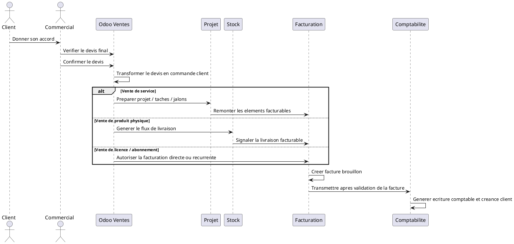

# Confirmation du Devis et Transformation en Commande Client dans Odoo 18

## 1. Introduction

La confirmation du devis marque le passage d'une proposition commerciale a un engagement client formel. Jusqu'a cette etape, le document reste une offre discutee et negociable. A partir du moment ou il est confirme dans Odoo, il change de nature et devient une commande client.

Cette etape est importante car elle officialise la decision commerciale. Elle permet a l'entreprise de considerer que le client s'est engage sur un contenu, un prix, des quantites, des taxes et des conditions commerciales. Le travail ne se limite donc plus au suivi commercial : il ouvre la voie a l'execution, a la facturation et, a terme, a l'impact comptable.

Dans l'environnement DigiPlus, cette transition est critique car la majorite des ventes portent sur des prestations de service, mais certaines commandes peuvent aussi concerner du materiel ou des licences. La confirmation doit donc etre comprise comme le point de depart operationnel des modules suivants.

## 2. Condition avant confirmation

Avant de confirmer un devis, plusieurs verifications doivent etre faites pour s'assurer que l'accord est reel, que le document est final et que l'entreprise peut engager l'execution.

Les points a verifier sont les suivants :

- `Accord client obtenu` : le client a accepte l'offre.
- `Devis valide en interne` : les responsables internes ont donne leur feu vert si necessaire.
- `Prix confirmes` : les montants sont definitifs.
- `Quantites confirmees` : jours, forfaits, licences, lots ou equipements sont valides.
- `Taxes verifiees` : la fiscalite appliquee est correcte.
- `Conditions de paiement validees` : acompte, echeancier ou paiement comptant sont fixes.
- `Validite du devis toujours correcte` : le devis n'a pas expire ou a ete revalide.
- `Termes et conditions acceptes` : les clauses commerciales sont connues et acceptees.
- `Mention Bon pour accord ou preuve d'acceptation disponible` : email, signature, portail client ou autre trace claire.
- `Statut metier x_decision_status coherent` : en pratique, le devis doit etre dans un etat de type `approved` avant confirmation, puis pouvoir passer a `won`.

L'objectif est d'eviter de confirmer trop tot un devis encore discute, incomplet ou non engageant.

## 3. Action dans Odoo

L'action utilisateur dans Odoo est simple, mais ses effets sont structurants.

Le commercial :

- ouvre le devis accepte ;
- verifie les informations finales ;
- clique sur le bouton `Confirmer` ;
- Odoo transforme le devis en commande client.

Le document change alors de nature :

```text
Devis
-> Commande client
```

Ce changement est fonctionnellement majeur. Le document n'est plus considere comme une proposition commerciale en attente, mais comme une commande exploitable par les modules suivants.

## 4. Effet de la confirmation

La confirmation declenche plusieurs effets dans Odoo :

- le devis n'est plus une simple proposition ;
- la commande client devient active ;
- les lignes de commande deviennent exploitables pour l'execution ;
- le systeme prepare les flux avals ;
- la facturation devient possible selon la politique de facturation ;
- une livraison peut etre generee si un produit physique est concerne ;
- un projet, des taches, des feuilles de temps ou des jalons peuvent etre generes si le service est configure dans ce sens.

Autrement dit, la confirmation ne produit pas uniquement un changement de statut commercial. Elle ouvre la chaine operationnelle.

## 5. Statuts apres confirmation

### Statuts standards Odoo

Les statuts standards du cycle commercial restent les suivants :

- `Devis brouillon`
- `Devis envoye`
- `Commande client`
- `Annule`

En pratique, le passage standard attendu est generalement :

```text
Envoye
-> Commande client
```

### Statut metier DigiPlus `x_decision_status`

Dans DigiPlus, le statut metier complete ce suivi standard.

Les valeurs les plus importantes a cette etape sont :

- `approved` : accord client obtenu ;
- `won` : devis gagne et confirme, ou pret a etre considere comme gagne definitivement.

Ce statut metier permet de distinguer :

- la validation commerciale par le client ;
- la transformation effective en commande ;
- le niveau reel d'avancement du dossier pour le pilotage de direction.

Le statut standard Odoo dit que le document est confirme. Le statut metier DigiPlus apporte une lecture plus fine de la decision commerciale.

## 6. Creation de la commande client

Une fois confirme, le devis devient une commande client contenant notamment :

- la `reference de commande` ;
- le `client` ;
- les `produits ou services vendus` ;
- les `quantites` ;
- les `prix` ;
- les `taxes` ;
- les `conditions de paiement` ;
- le `commercial responsable` ;
- l'`equipe commerciale` ;
- le `montant total` ;
- le `statut de livraison` si applicable ;
- le `statut de facturation`.

La commande client devient le document de reference pour l'entreprise. C'est elle qui sera utilisee pour preparer le service, la livraison et la facture.

## 7. Branche service

Le cas principal chez DigiPlus est la vente de service.

Le flux se lit ainsi :

```text
Commande client
-> Service a executer
-> Projet / taches / jalons si necessaire
-> Facturation
```

Exemples :

- prestation ERP Odoo ;
- implementation CRM ;
- site web ;
- formation ;
- support technique ;
- transformation digitale.

Dans ce cas :

- il n'y a pas de mouvement de stock ;
- la commande peut alimenter un projet ou des taches selon la configuration ;
- les feuilles de temps ou jalons peuvent ensuite servir a la facturation.

Dans votre environnement, le module `digiplus_project` depend de `sale_timesheet`, ce qui confirme que la logique de vente de services et de suivi facturable par projet fait partie du cadre DigiPlus.

## 8. Branche produit physique

Le cas secondaire concerne les produits physiques ou le materiel informatique.

Le flux est le suivant :

```text
Commande client
-> Stock
-> Bon de livraison
-> Livraison validee
-> Facturation
```

Exemples :

- ordinateur ;
- routeur ;
- equipement reseau ;
- imprimante ;
- scanner ;
- materiel informatique.

Dans ce cas, la confirmation peut generer un ordre de livraison si le produit est stockable et configure pour etre livre. Le module Stock prend alors le relais sur la preparation, la reservation et la validation de la sortie.

## 9. Branche licence ou abonnement

Le cas des licences Microsoft 365 ou du support recurrent suit une logique plus directe.

Deux variantes sont possibles :

```text
Commande client
-> Facturation directe
```

ou

```text
Commande client
-> Abonnement / facturation recurrente si configure
```

Ce type de vente peut etre facture :

- immediatement, si l'offre est simple ou prepaid ;
- periodiquement, si le modele commercial repose sur un abonnement ou un contrat recurrent.

Cette branche est importante pour DigiPlus car elle correspond a des revenus de service ou de licence qui ne relevent ni du stock ni toujours d'un projet detaille.

## 10. Lien avec la facturation

La commande client confirmee devient la base de la facture.

Selon la configuration Odoo, plusieurs modes sont possibles :

- `facture totale` ;
- `facture partielle` ;
- `facture d'acompte` ;
- `facture apres livraison` ;
- `facture au jalon` ;
- `facture selon le temps passe`.

Le workflow general est le suivant :

```text
Commande client confirmee
-> Creer une facture
-> Facture brouillon
-> Validation comptable
```

Dans l'environnement DigiPlus, la facture peut ensuite porter un statut d'export vers Sage Saari, mais cette etape intervient apres la creation et la validation de la facture, pas au moment de la confirmation du devis.

## 11. Lien avec la comptabilite

La commande client seule ne cree pas encore forcement une ecriture comptable definitive.

L'impact comptable devient reel lorsque la facture client est validee.

Le workflow est le suivant :

```text
Commande client
-> Facture brouillon
-> Facture validee
-> Ecriture comptable
-> Creance client
```

Cette distinction est essentielle en demonstration :

- la `commande client` engage le flux operationnel ;
- la `facture validee` engage le flux comptable.

## 12. Documents generes ou mis a jour

La confirmation met a jour ou prepare plusieurs documents :

- le `devis accepte` ;
- la `commande client` ;
- le `bon de livraison` si produit physique ;
- le `projet` ou les `taches` si le service est configure dans ce sens ;
- la `facture brouillon` si la facturation est lancee ;
- l'`historique de validation` dans le chatter.

Le document commercial d'origine reste donc present, mais il est depasse par la commande client comme document central de pilotage.

## 13. Tableau recapitulatif

| Etape | Acteur | Action | Document genere | Statut | Module suivant |
|---|---|---|---|---|---|
| Verification finale | Commercial | Controle accord, prix, quantites, conditions | Devis final valide | `approved` | Confirmation |
| Confirmation du devis | Commercial | Clique sur `Confirmer` | Devis confirme | `Commande client` | Vente |
| Creation commande client | Odoo Ventes | Transforme le devis | Commande client | `sale` / `won` | Projet / Stock / Facturation |
| Declenchement service | Odoo Ventes / Delivery | Prepare l'execution du service | Projet, taches, jalons ou suivi service | Commande active | Projet |
| Declenchement stock | Odoo Ventes / Stock | Lance la livraison si produit stockable | Bon de livraison | A livrer / livre | Stock |
| Preparation facture | ADV / Comptable | Creer la facture selon la politique choisie | Facture brouillon | A facturer / facture brouillon | Facturation |
| Transmission vers facturation | Facturation | Valider la facture | Facture validee | Posted | Comptabilite |

## 14. Mini-workflow textuel

```text
Devis envoye
-> Accord client
-> Verification finale
-> Confirmation
-> Commande client
-> Service / Stock / Licence
-> Facturation
-> Comptabilite
```

## 15. Sequence UML textuelle



## 16. Resume operationnel

Dans Odoo 18, la confirmation du devis transforme une offre commerciale acceptee en commande client exploitable par l'entreprise. Le commercial verifie d'abord l'accord client, les montants, les quantites et les conditions, puis confirme le document dans le module Ventes. A partir de la, la commande devient active et peut alimenter un projet, une livraison ou une facturation directe selon ce qui a ete vendu. Pour DigiPlus, cela concerne surtout des prestations de service, mais le meme principe s'applique aussi au materiel et aux licences. La commande client ne cree pas encore a elle seule l'impact comptable final. Cet impact apparait surtout lorsque la facture issue de la commande est validee. La confirmation du devis est donc l'etape qui fait passer la vente du niveau commercial au niveau operationnel et financier.
