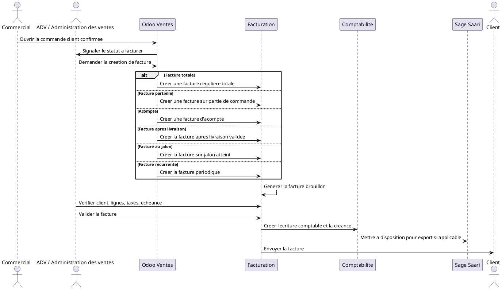

# Connexion Vente -> Facturation : Creation de la Facture Client dans Odoo 18

## 1. Introduction

La facturation est l'etape qui transforme une commande commerciale en document financier. Tant qu'une commande client reste au niveau du module Ventes, elle exprime un engagement commercial et operationnel. La facture client, elle, materialise le montant du par le client et fait entrer la vente dans un circuit financier controle.

Dans Odoo 18, la facture client sert donc de pivot entre la commande client et la Comptabilite. Elle reprend les informations de la vente, permet une verification finale, puis devient, apres validation, une piece comptable officielle.

Pour DigiPlus, cette etape est essentielle car les ventes concernent majoritairement des services digitaux, des licences et des contrats de support. La facture doit donc etre comprise comme le document qui officialise la creance client et prepare le suivi du paiement, voire l'export vers Sage Saari.

## 2. Point de depart

La facture peut etre creee lorsque la commande client est confirmee et que les conditions de facturation sont reunies.

Le workflow de base est le suivant :

```text
Commande client confirmee
-> Statut "A facturer"
-> Creer une facture
-> Facture brouillon
```

Ce point de depart varie selon la politique de facturation :

- facturation immediate apres confirmation ;
- facturation apres livraison ;
- facturation a l'acompte ;
- facturation au jalon ;
- facturation au temps passe ;
- facturation recurrente si configuree.

## 3. Chemin dans Odoo

Le chemin utilisateur dans Odoo suit en general cette logique :

- ouvrir la commande client confirmee ;
- verifier le statut de facturation ;
- cliquer sur `Creer une facture` ;
- choisir le type de facture si Odoo le demande ;
- generer la facture brouillon.

La facture generee reprend automatiquement les informations de la commande client. Le travail de l'utilisateur consiste alors surtout a verifier, ajuster si necessaire, puis valider.

## 4. Donnees reprises depuis la commande client

Lorsqu'Odoo genere la facture a partir de la commande, plusieurs donnees sont transferees automatiquement :

- le `client` ;
- l'`adresse de facturation` ;
- la `reference de commande` ;
- les `produits ou services vendus` ;
- les `descriptions` ;
- les `quantites facturables` ;
- les `prix unitaires` ;
- les `remises` ;
- les `taxes` ;
- les `conditions de paiement` ;
- le `commercial responsable` ;
- le `montant total`.

Dans votre environnement DigiPlus, la facture reprend aussi le lien d'origine via `invoice_origin`, ce qui permet de rattacher clairement la facture a la commande ou au devis source.

## 5. Types de facturation possibles

Odoo permet plusieurs modes de facturation selon la nature de la vente et la politique retenue.

### A. Facture totale

La totalite de la commande est facturee en une seule fois. C'est le cas le plus simple, souvent adapte aux petites prestations, aux ventes directes de licences ou a certaines ventes de materiel.

### B. Facture partielle

Seule une partie de la commande est facturee. Cela peut correspondre a certaines lignes, certaines quantites ou une execution partielle.

### C. Facture d'acompte

Un pourcentage ou un montant fixe est facture avant execution complete. Ce mode est tres courant pour les projets ERP, web ou de transformation digitale.

### D. Facture apres livraison

La facture est creee apres validation de la livraison. Ce cas s'applique surtout aux produits physiques selon la politique `quantites livrees`.

### E. Facture au jalon

La facture est creee lorsqu'un jalon du projet est atteint. Cette logique convient bien aux prestations structurees en etapes : cadrage, parametrage, recette, mise en production.

### F. Facture au temps passe

La facture depend des heures enregistrees sur les taches ou feuilles de temps. Cette logique est pertinente pour les missions de support, d'assistance ou de regie.

### G. Facture recurrente

La facture est generee periodiquement pour les abonnements, contrats de support ou licences facturees sur une base mensuelle, trimestrielle ou annuelle.

## 6. Adaptation aux cas DigiPlus

### Prestation Odoo

La facturation peut se faire :

- par acompte de demarrage ;
- par jalon de projet ;
- par solde final.

### Developpement web

La facturation peut etre decoupee en plusieurs etapes :

- demarrage ;
- validation de maquette ;
- livraison finale.

### Formation

La facture peut etre emise :

- avant la session ;
- apres validation de la participation ;
- ou en lien avec une commande globale de projet.

### Support technique

La facturation est souvent mensuelle ou recurrente, surtout si le support est vendu sous forme de contrat.

### Licence Microsoft 365

La facture peut etre :

- immediate, si les licences sont vendues directement ;
- periodique, si elles s'inscrivent dans un contrat ou un abonnement.

### Materiel informatique

La facturation peut se faire :

- a la commande ;
- ou apres livraison, selon la politique choisie.

## 7. Facture brouillon

La premiere facture creee est une facture brouillon.

Son role est de :

- permettre la verification avant validation ;
- corriger les lignes si necessaire ;
- verifier les taxes ;
- verifier les conditions de paiement ;
- verifier l'echeance ;
- verifier le client ;
- eviter les erreurs comptables.

A ce stade, la facture n'est pas encore une ecriture comptable definitive. C'est un document preparatoire, controle par l'equipe commerciale, l'ADV ou la comptabilite avant validation.

## 8. Controles avant validation

Avant de valider la facture, plusieurs controles sont obligatoires :

- `Client correct`
- `Adresse de facturation correcte`
- `Reference de commande correcte`
- `Lignes de facture correctes`
- `Quantites facturees correctes`
- `Prix conformes a la commande`
- `Remises validees`
- `TVA correcte`
- `Conditions de paiement correctes`
- `Echeance correcte`
- `Montant total coherent`
- `Statut d'export Sage Saari non encore finalise`

L'objectif est d'eviter qu'une facture erronee n'entre en comptabilite, car une correction apres validation est plus sensible qu'une correction sur brouillon.

## 9. Validation de la facture

L'action utilisateur est la suivante :

- ouvrir la facture brouillon ;
- verifier les informations ;
- cliquer sur `Confirmer` ou `Valider` selon l'interface ;
- Odoo transforme la facture brouillon en facture validee.

Le changement de statut se lit ainsi :

```text
Draft
-> Posted
```

Une fois validee, la facture devient une piece comptable officielle. Dans la logique Odoo, elle est numerotee, rattachee au journal de vente et prise en compte dans le suivi comptable.

## 10. Effet de la validation sur la Comptabilite

La validation de la facture genere automatiquement :

- une `ecriture comptable` ;
- une `ligne dans le journal de vente` ;
- une `creance client` ;
- un `montant de chiffre d'affaires` ;
- une `TVA collectee` si applicable ;
- un `solde a recevoir du client`.

Le workflow devient alors :

```text
Facture validee
-> Ecriture comptable
-> Creance client
-> Suivi du paiement
```

Cette distinction est essentielle : la commande client n'est pas encore une creance comptable definitive. C'est la facture validee qui alimente officiellement la comptabilite.

## 11. Statuts de la facture

### Statuts principaux

Les statuts principaux de la facture sont :

- `Brouillon`
- `Validee / Comptabilisee`
- `Annulee`

### Statuts de paiement

Une fois la facture validee, le suivi du paiement peut faire apparaitre les statuts suivants :

- `Non payee`
- `Partiellement payee`
- `En paiement`
- `Payee`

Le statut de paiement evolue apres enregistrement du paiement ou rapprochement bancaire, pas au moment de la simple creation de la facture.

## 12. Statut d'export Sage Saari

Dans le contexte DigiPlus, la facture peut porter un statut d'export vers Sage Saari pour suivre sa transmission vers le systeme comptable externe.

Les statuts fonctionnels possibles sont :

- `Non exportee`
- `Prete a exporter`
- `Exportee`
- `Erreur d'export`

L'interet est de :

- suivre les factures deja transferees ;
- eviter les doubles exports ;
- identifier les erreurs ;
- securiser la synchronisation entre Odoo et Sage Saari.

Dans votre environnement, ce suivi est materialise par le champ `x_sage_saari_export_status`.

## 13. Documents generes

La phase de facturation cree ou met a jour les elements suivants :

- `Facture client brouillon`
- `Facture client validee`
- `PDF de facture`
- `Ecriture comptable`
- `Ligne de journal de vente`
- `Creance client`
- `Historique dans le chatter`
- `Statut d'export` si applicable

La facture devient alors le document central du cycle financier de la vente.

## 14. Tableau recapitulatif

| Etape | Acteur | Action | Document genere | Statut | Module suivant |
|---|---|---|---|---|---|
| Commande client confirmee | Commercial | Finalise la vente et rend la commande facturable | Commande client active | `A facturer` | Ventes |
| Verification du statut a facturer | Commercial / ADV | Controle si la facture peut etre creee | Commande eligible a facturation | `To invoice` | Facturation |
| Creation de la facture | Commercial / ADV | Clique sur `Creer une facture` | Demande de facture | Creation en cours | Facturation |
| Generation de la facture brouillon | Odoo Ventes / Facturation | Reprend les donnees de la commande | Facture brouillon | `Draft` | Verification |
| Verification de la facture | ADV / Comptable | Controle client, lignes, taxes, echeance | Facture prete a valider | `Draft` | Validation |
| Validation de la facture | Comptable / ADV habilite | Valide la facture | Facture validee | `Posted` | Comptabilite |
| Creation de l'ecriture comptable | Odoo Comptabilite | Genere la piece comptable | Ecriture + journal de vente + creance | Comptabilise | Suivi du paiement |
| Suivi du paiement | Comptable | Suit encaissement et solde | Statut de paiement | `Not Paid` / `In Payment` / `Paid` | Banque |
| Preparation export Sage Saari | Comptable / Integration | Marque ou exporte la facture | Statut d'export | `ready` / `exported` | Sage Saari |

## 15. Mini-workflow textuel

```text
Commande client confirmee
-> Statut A facturer
-> Creer une facture
-> Choix du type de facturation
-> Facture brouillon
-> Verification
-> Validation
-> Facture comptabilisee
-> Creance client
-> Paiement / Banque
```

## 16. Sequence UML textuelle



## 17. Points de vigilance

Erreurs a eviter :

- creer une facture avec le mauvais client ;
- facturer une mauvaise quantite ;
- oublier la TVA ;
- confondre devis, commande et facture ;
- valider trop vite une facture brouillon ;
- facturer avant livraison si la politique l'interdit ;
- oublier les conditions de paiement ;
- ne pas controler l'echeance ;
- exporter deux fois la meme facture vers Sage Saari ;
- ne pas suivre les factures impayees.

## 18. Cas pratique DigiPlus

### Cas 1 : Implementation Odoo + formation utilisateurs

Client : entreprise professionnelle  
Besoin : implementation Odoo + formation utilisateurs  
Commande client : confirmee

Facturation :

- acompte de demarrage ;
- facture intermediaire au jalon de parametrage ;
- facture finale apres formation.

Lecture fonctionnelle :

- la commande client est confirmee ;
- Odoo permet de creer d'abord un acompte ;
- apres atteinte du jalon de parametrage, une nouvelle facture brouillon est creee ;
- apres verification, elle est validee et comptabilisee ;
- une facture finale est ensuite emise a la cloture de la prestation.

### Cas 2 : Licences Microsoft 365 + support mensuel

Client : PME  
Besoin : licence Microsoft 365 + support mensuel  
Commande client : confirmee

Facturation :

- facture immediate pour les licences ;
- facturation recurrente pour le support.

Lecture fonctionnelle :

- la partie licences peut etre facturee des confirmation ;
- le support peut suivre une logique periodique si le modele commercial est configure pour cela ;
- chaque facture validee alimente ensuite la comptabilite et le suivi du paiement.

## 19. Resume operationnel

Dans Odoo 18, la facture client est creee a partir d'une commande client confirmee, lorsque les conditions de facturation sont reunies. L'utilisateur lance la creation depuis la commande, choisit le type de facturation si necessaire, puis Odoo genere d'abord une facture brouillon. Cette facture est verifiee avant validation pour controler le client, les lignes, la TVA, les conditions de paiement et l'echeance. Une fois validee, elle devient une piece comptable officielle, cree la creance client et alimente le journal de vente. Le paiement est ensuite suivi jusqu'au rapprochement bancaire. Dans DigiPlus, cette etape peut aussi inclure un suivi d'export vers Sage Saari pour securiser la transmission vers le systeme comptable externe.
