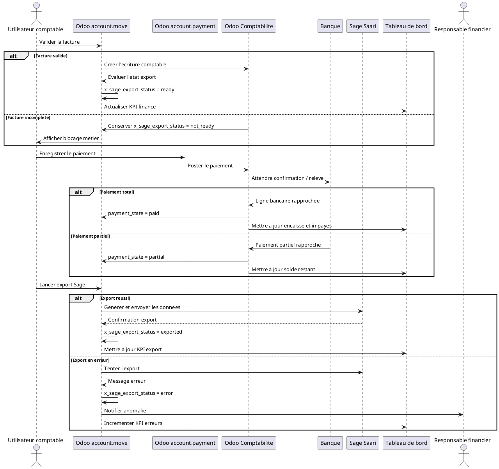

# Developpement Technique du Module Comptabilite Odoo 18 pour DigiPlus

## 1. Introduction technique

L'objectif du module `digiplus_accounting` est d'etendre la comptabilite native d'Odoo 18 sans la remplacer. Le coeur Odoo doit continuer a gerer :

- les factures clients et fournisseurs ;
- les paiements ;
- les journaux ;
- les ecritures comptables ;
- les rapprochements bancaires ;
- les rapports standards.

Le module DigiPlus ajoute par-dessus :

- des champs de suivi metier ;
- des statuts d'export Sage Saari ;
- des vues adaptees aux equipes finance ;
- des menus de pilotage ;
- des controles de securite ;
- des automatisations de relance et d'export ;
- des rapports de suivi complementaires ;
- un dashboard finance cible DigiPlus.

### Etat de l'existant dans ce depot

Le depot contient deja un premier niveau d'extension comptable dans `digiplus_agrochem_demo` :

- extension de `account.move` dans `addons/digiplus_agrochem_demo/models/account_move.py` ;
- champs existants `x_sage_saari_export_status`, `x_sage_saari_reference`, `x_integration_comment` ;
- vues facture dediees dans `addons/digiplus_agrochem_demo/views/account_move_views.xml` ;
- rapport facture QWeb dans `addons/digiplus_agrochem_demo/reports/invoice_report.xml` ;
- menu `Facturation & Sage Saari` dans `addons/digiplus_agrochem_demo/views/menu_views.xml`.

La bonne trajectoire technique consiste donc a :

1. isoler la logique comptable dans un module propre `digiplus_accounting` ;
2. reprendre ou migrer les champs deja presents ;
3. faire dependre le module demo de ce nouveau module si l'environnement de demonstration doit le reutiliser.

## 2. Architecture generale du module

Structure recommandee :

```text
digiplus_accounting/
|-- __init__.py
|-- __manifest__.py
|-- models/
|   |-- __init__.py
|   |-- account_move.py
|   |-- account_payment.py
|   |-- account_bank_statement.py
|   |-- res_partner.py
|   |-- accounting_dashboard.py
|   `-- sage_export_log.py            # optionnel mais recommande
|-- views/
|   |-- account_move_views.xml
|   |-- account_payment_views.xml
|   |-- accounting_dashboard_views.xml
|   |-- menu_views.xml
|   |-- res_partner_views.xml
|   `-- sage_export_log_views.xml     # optionnel
|-- security/
|   |-- ir.model.access.csv
|   `-- accounting_security.xml
|-- data/
|   |-- accounting_sequences.xml
|   |-- accounting_mail_templates.xml
|   |-- accounting_cron.xml
|   `-- accounting_server_actions.xml # optionnel
|-- reports/
|   |-- invoice_report.xml
|   |-- financial_dashboard_report.xml
|   `-- aging_report.xml
|-- tests/
|   |-- __init__.py
|   |-- test_account_move_flow.py
|   |-- test_payment_flow.py
|   |-- test_sage_export.py
|   |-- test_security.py
|   `-- test_dashboard.py
`-- static/
    `-- description/
        `-- icon.png
```

### Role de chaque dossier

- `models/` : heritage Python des modeles natifs Odoo et logique metier.
- `views/` : heritages XML des formulaires, listes, recherches, graphes et menus.
- `security/` : groupes, ACL, regles d'acces, restrictions de configuration.
- `data/` : sequences, templates mail, crons, server actions et donnees techniques.
- `reports/` : QWeb PDF, actions de rapport et variantes de reporting ciblees.
- `tests/` : tests unitaires et d'integration Odoo.
- `static/description/` : icone et description technique du module.

### Recommandation d'architecture

Pour rester propre et maintenable :

- ne pas continuer a disperser la logique finance dans `digiplus_agrochem_demo` ;
- deplacer progressivement la logique comptable vers `digiplus_accounting` ;
- garder `digiplus_agrochem_demo` pour la demo et les jeux de donnees ;
- utiliser des heritages `inherit_id` pour les vues et `_inherit` pour les modeles ;
- eviter toute modification directe du coeur Odoo.

## 3. Dependances du module

### Dependances minimales

```python
{
    "name": "DigiPlus Accounting",
    "version": "18.0.1.0.0",
    "depends": [
        "account",
        "mail",
    ],
}
```

### Dependances recommandees

```python
{
    "depends": [
        "account",
        "sale_management",
        "purchase",
        "mail",
        "stock",
        "project",
        "hr_expense",
        "web",
    ],
}
```

### Pourquoi chaque dependance est utile

| Module | Utilite technique |
|---|---|
| `account` | Base obligatoire : factures, paiements, journaux, ecritures, rapprochement |
| `sale_management` | Lien facture <-> commande client, origine commerciale, relances clients |
| `purchase` | Lien facture fournisseur <-> commande fournisseur |
| `stock` | Valorisation stock et impact comptable si DigiPlus gere du materiel |
| `project` | Lien projet / analytique / prestations de services |
| `hr_expense` | Alimentation de la comptabilite via notes de frais |
| `mail` | Chatter, `mail.activity`, notifications, suivi des erreurs et relances |
| `web` | Vue dashboard avancee, assets JS si besoin de widgets metier |

### Note pour cet environnement

Le module `digiplus_project` depend deja de `sale_timesheet`. Si DigiPlus veut retrouver automatiquement le projet lie a une facture de service, il vaut mieux soit :

- faire dependre `digiplus_accounting` de `project` uniquement ;
- soit creer un petit bridge optionnel avec `digiplus_project` si la logique locale doit etre plus fine.

## 4. Extension du modele account.move

`account.move` reste le modele pivot des factures clients, des factures fournisseurs et des ecritures comptables. C'est donc la priorite numero un du module.

### 4.1 Recommandation de compatibilite avec l'existant

Le depot contient deja :

- `x_sage_saari_export_status`
- `x_sage_saari_reference`
- `x_integration_comment`

Deux options sont possibles :

1. conserver ces noms et les etendre ;
2. normaliser vers les noms cibles du prompt, avec script de migration.

Recommandation pour ce depot :

- conserver les champs deja existants pour ne pas casser la demo ;
- introduire les noms cibles uniquement si une migration est planifiee ;
- documenter un mapping de compatibilite.

Exemple de mapping recommande :

| Cible fonctionnelle | Champ existant depot | Decision recommande |
|---|---|---|
| `x_sage_export_status` | `x_sage_saari_export_status` | Conserver l'existant ou migrer avec script |
| `x_sage_export_reference` | `x_sage_saari_reference` | Conserver l'existant ou migrer |
| `x_finance_comment` | `x_integration_comment` | Preferer un nouveau champ si commentaire finance distinct |

### 4.2 Champs recommandes sur account.move

| Nom technique | Type | Libelle | Valeurs possibles | Utilite metier | Vue cible |
|---|---|---|---|---|---|
| `x_sage_export_status` | `fields.Selection` | Statut export Sage | `not_ready`, `ready`, `exported`, `error`, `cancelled` | Piloter l'export vers Sage et eviter les doublons | Formulaire facture, liste, recherche |
| `x_sage_export_date` | `fields.Datetime` | Date export Sage | Date/heure | Tracer quand l'export a eu lieu | Onglet Suivi DigiPlus |
| `x_sage_export_reference` | `fields.Char` | Reference export Sage | libre, sequencee | Conserver la reference technique du lot ou de l'ecriture exportee | Formulaire facture, liste export |
| `x_sage_export_error` | `fields.Text` | Erreur export Sage | message libre | Exposer l'erreur retournee par l'export | Onglet Suivi DigiPlus, groupe finance |
| `x_validation_level` | `fields.Selection` | Niveau de validation | `draft`, `checked`, `approved`, `director_ok` | Distinguer controle comptable et validation finance | En-tete facture |
| `x_internal_control_status` | `fields.Selection` | Controle interne | `pending`, `reviewed`, `validated`, `rejected` | Suivre le controle interne avant export | Onglet Suivi DigiPlus |
| `x_finance_comment` | `fields.Text` | Commentaire finance | texte libre | Commentaire interne comptable ou financier | Onglet Suivi DigiPlus |
| `x_payment_followup_status` | `fields.Selection` | Statut relance paiement | `none`, `planned`, `in_progress`, `escalated`, `resolved` | Suivre la relance des impayes | Liste factures, formulaire |
| `x_business_origin` | `fields.Selection` | Origine metier | `sale`, `purchase`, `expense`, `stock`, `payroll`, `manual` | Comprendre le flux source qui alimente l'ecriture | Formulaire facture/ecriture, recherche |
| `x_related_project_id` | `fields.Many2one('project.project')` | Projet lie | projet | Relier facture et execution projet | Formulaire facture |
| `x_related_sale_order_id` | `fields.Many2one('sale.order')` | Commande client liee | commande | Navigation rapide facture <-> vente | Formulaire facture |
| `x_customer_category` | `fields.Selection` ou `fields.Char` liee | Categorie client | selon segmentation DigiPlus | Ventiler les rapports par categorie | Liste, recherche, rapport |
| `x_digiplus_invoice_type` | `fields.Selection` | Type facture DigiPlus | `erp`, `crm`, `web`, `training`, `support`, `m365`, `mixed` | Analyser le CA par offre | Formulaire, recherche, dashboard |

### 4.3 Attributs techniques recommandes

Pour la plupart de ces champs :

- `copy=False`
- `tracking=True` pour les champs de suivi sensibles
- `index=True` pour les champs filtres frequents
- `readonly=True` apres export ou apres certains statuts
- `groups=` sur les champs sensibles comme `x_sage_export_error`

### 4.4 Champs computes ou saisis

Recommandation de conception :

- `x_related_sale_order_id` : compute + store si l'origine peut etre detectee ;
- `x_related_project_id` : compute + store, avec override manuel si lien ambigu ;
- `x_customer_category` : related stockee vers la segmentation partenaire si elle existe deja ;
- `x_digiplus_invoice_type` : selection saisie ou computee par analyse des lignes.

### 4.5 Exemple de squelette Python

```python
from odoo import api, fields, models, _
from odoo.exceptions import UserError, ValidationError


class AccountMove(models.Model):
    _inherit = "account.move"

    x_sage_export_status = fields.Selection(
        [
            ("not_ready", "Non pret"),
            ("ready", "Pret a exporter"),
            ("exported", "Exporte"),
            ("error", "Erreur export"),
            ("cancelled", "Annule"),
        ],
        default="not_ready",
        copy=False,
        tracking=True,
        index=True,
    )
```

## 5. Statut d'export Sage Saari

Le champ `x_sage_export_status` est le coeur de la logique d'integration externe.

### 5.1 Valeurs cibles

- `not_ready` : facture non complete ou non validee ;
- `ready` : facture validee et controlee, export autorise ;
- `exported` : export effectue avec succes ;
- `error` : tentative d'export en echec ;
- `cancelled` : export abandonne ou facture annulee.

### 5.2 Regles de changement de statut

| Evenement | Nouveau statut |
|---|---|
| Facture en brouillon | `not_ready` |
| Facture validee mais incomplete fonctionnellement | `not_ready` |
| Facture validee et controle interne OK | `ready` |
| Export Sage reussi | `exported` |
| Export Sage en erreur | `error` |
| Facture annulee ou export retire du lot | `cancelled` |

### 5.3 Qui peut le modifier

- `group_accounting_manager_digiplus` : peut basculer `not_ready` -> `ready` et `error` -> `ready`
- `group_finance_director_digiplus` : peut autoriser re-export et annulation
- `group_sage_export_manager` : peut executer l'export
- utilisateur comptable standard : lecture seule ou bascule limitee selon process

### 5.4 Validations a imposer avant `ready`

Une facture ne doit passer a `ready` que si :

- `state == posted`
- `partner_id` renseigne
- `journal_id` renseigne
- lignes facture presentes
- comptes comptables resolus
- taxes conformes si taxe obligatoire
- pas de reference export deja active

### 5.5 Prevention du double export

Mesures recommandees :

- bloquer `action_export_to_sage` si statut deja `exported` ;
- exiger un groupe special pour le re-export ;
- stocker une reference unique d'export ;
- ecrire un log d'export avec horodatage ;
- journaliser l'action dans le chatter ;
- verrouiller les champs critiques apres export.

### 5.6 Affichage des erreurs

L'erreur d'export doit etre visible dans :

- un champ texte `x_sage_export_error` ;
- le chatter ;
- une vue liste filtree `Erreurs d'export` ;
- un compteur dashboard finance ;
- eventuellement une activite `mail.activity` pour le responsable finance.

### 5.7 Filtres de recherche recommandes

- `Factures pretes a exporter`
- `Factures exportees`
- `Factures en erreur`
- `Factures non pretes`
- `Factures annulees`
- `Par type DigiPlus`
- `Par commande liee`

## 6. Extension du modele account.payment

`account.payment` porte les paiements entrants et sortants. Dans DigiPlus, il doit servir a tracer la source du paiement, son statut de rapprochement et son eventuel export comptable externe.

### 6.1 Champs recommandes

| Nom technique | Type | Libelle | Valeurs possibles | Usage principal | Vue cible |
|---|---|---|---|---|---|
| `x_payment_origin` | `fields.Selection` | Origine paiement | `customer`, `supplier`, `refund`, `mobile_money`, `bank`, `cash` | Identifier le canal metier | Formulaire paiement |
| `x_bank_confirmation_reference` | `fields.Char` | Reference bancaire | libre | Tracer l'ID de confirmation bancaire | Formulaire paiement, liste |
| `x_reconciliation_status` | `fields.Selection` | Statut rapprochement | `not_reconciled`, `partial`, `reconciled`, `exception` | Lire rapidement l'etat de rapprochement | Liste, formulaire |
| `x_mobile_money_reference` | `fields.Char` | Reference Mobile Money | libre | Tracer Orange Money / MTN / autre | Formulaire paiement |
| `x_payment_validation_status` | `fields.Selection` | Validation paiement | `draft`, `confirmed`, `bank_confirmed`, `cancelled` | Distinguer saisie et confirmation bancaire | Formulaire paiement |
| `x_sage_payment_export_status` | `fields.Selection` | Export paiement Sage | `not_ready`, `ready`, `exported`, `error`, `cancelled` | Pilotage export des paiements | Formulaire, liste export |
| `x_payment_comment` | `fields.Text` | Commentaire paiement | texte libre | Annotation finance | Formulaire paiement |

### 6.2 Cas d'usage cibles

- paiement client total ;
- paiement fournisseur ;
- paiement partiel ;
- paiement Mobile Money ;
- paiement bancaire ;
- paiement a exporter vers Sage Saari.

### 6.3 Recommandations techniques

- mettre `x_reconciliation_status` a jour apres changement de `reconciled_invoice_ids` ou apres variation des lignes rapprochees ;
- ne pas confondre `payment_state` de la facture et `x_payment_validation_status` du paiement ;
- si DigiPlus gere de multiples canaux, standardiser `x_payment_origin` pour le reporting.

## 7. Extension du modele res.partner

`res.partner` doit etre etendu pour preparer l'identification comptable, le suivi fiscal et le risque client.

### 7.1 Champs recommandes

| Nom technique | Type | Libelle | Valeurs possibles | Interet metier | Vue cible |
|---|---|---|---|---|---|
| `x_customer_code` | `fields.Char` | Code client | code interne | Reference export et reporting | Fiche partenaire |
| `x_supplier_code` | `fields.Char` | Code fournisseur | code interne | Reference achats et export | Fiche partenaire |
| `x_taxpayer_number` | `fields.Char` | Numero contribuable | libre | Suivi fiscal | Fiche partenaire |
| `x_rccm` | `fields.Char` | RCCM | libre | Conformite legale locale | Fiche partenaire |
| `x_default_payment_term_id` | `fields.Many2one('account.payment.term')` | Condition de paiement par defaut | terme | Prefill finance | Fiche partenaire |
| `x_credit_limit` | `fields.Monetary` | Limite de credit | montant | Controle des risques clients | Fiche partenaire |
| `x_risk_level` | `fields.Selection` | Niveau de risque | `low`, `medium`, `high`, `blocked` | Relances et arbitrage commercial | Fiche partenaire, liste |
| `x_followup_responsible_id` | `fields.Many2one('res.users')` | Responsable relance | utilisateur | Assigner un proprietaire de recouvrement | Fiche partenaire |

### 7.2 Interet technique et metier

- meilleure identification client et fournisseur ;
- preparation des exports comptables ;
- suivi fiscal ;
- suivi des creances et dettes ;
- blocage ou alerte si limite de credit depassee ;
- affectation claire du recouvrement.

### 7.3 Lien avec l'existant du depot

Le depot contient deja des champs B2B sur `res.partner` comme :

- `x_company_sector`
- `x_geographic_zone`
- `x_client_type`
- `x_priority_level`

Recommandation :

- reutiliser `x_client_type` pour nourrir `x_customer_category` sur facture ;
- ne pas dupliquer la segmentation si elle existe deja sur le partenaire.

## 8. Vues a modifier

Toutes les vues doivent etre faites par heritage XML avec `inherit_id` et `xpath`, jamais par copie integrale d'une vue standard sauf cas exceptionnel.

### 8.1 Factures clients

Vues a heriter :

- formulaire `account.move` pour `move_type in ('out_invoice', 'out_refund')`
- liste des factures clients
- recherche

Ajouts recommandes :

- onglet `Suivi DigiPlus`
- statut export Sage
- date et reference export
- lien commande client
- lien projet
- statut relance
- commentaire financier
- niveau de validation
- controle interne

### 8.2 Factures fournisseurs

Ajouts recommandes :

- statut controle interne
- statut paiement
- reference fournisseur
- export Sage si DigiPlus l'utilise aussi cote achat
- commentaire finance

### 8.3 Paiements

Ajouts recommandes :

- reference bancaire
- statut rapprochement
- reference Mobile Money
- statut export paiement
- commentaire finance

### 8.4 Partenaires

Ajouts recommandes :

- informations fiscales
- limite de credit
- niveau de risque
- responsable de suivi
- codes client/fournisseur

### 8.5 Recommandation de structure de formulaire facture

```text
Header
|-- Statut facture
|-- Niveau validation
|-- Boutons export / controle

Notebook
|-- Lignes
|-- Suivi DigiPlus
|-- Sage Saari
|-- Historique / chatter
```

### 8.6 Vues de recherche

Ajouter des filtres et group by pour :

- statut export
- type facture DigiPlus
- origine metier
- categorie client
- projet
- commande
- statut relance
- niveau de risque partenaire

## 9. Menus et actions

### 9.1 Structure de menus recommandee

```text
Comptabilite DigiPlus
|-- Tableau de bord financier
|-- Factures clients
|-- Factures fournisseurs
|-- Paiements clients
|-- Paiements fournisseurs
|-- Rapprochement bancaire
|-- Export Sage Saari
|   |-- Factures pretes a exporter
|   |-- Factures exportees
|   `-- Erreurs d'export
|-- Suivi des creances
|-- Rapports SYSCOHADA
`-- Configuration
```

### 9.2 Recommandation de positionnement

- en production : menus principaux sous l'application native `Comptabilite`
- dans ce depot demo : raccourcis optionnels sous `DigiPlus Consulting`

### 9.3 Tableau des menus

| Menu | Modele | Domaine | Vue | Groupe autorise |
|---|---|---|---|---|
| Tableau de bord financier | `digiplus.dashboard.metric` etendu ou modele finance dedie | `metric_type = finance` ou domaine equivalent | kanban, graph, pivot, list | comptable, manager, finance director |
| Factures clients | `account.move` | `move_type in ('out_invoice', 'out_refund')` | list, form, search | comptable, manager, auditeur lecture |
| Factures fournisseurs | `account.move` | `move_type in ('in_invoice', 'in_refund')` | list, form, search | comptable, manager, auditeur lecture |
| Paiements clients | `account.payment` | `payment_type = 'inbound'` | list, form | comptable, manager |
| Paiements fournisseurs | `account.payment` | `payment_type = 'outbound'` | list, form | comptable, manager |
| Rapprochement bancaire | `account.bank.statement.line` ou action standard de reconciliation | lignes non rapprochees | list ou widget natif | comptable banque, manager |
| Factures pretes a exporter | `account.move` | `x_sage_export_status = 'ready'` | list, form | export manager, finance director |
| Factures exportees | `account.move` | `x_sage_export_status = 'exported'` | list, form | comptable, manager, auditeur lecture |
| Erreurs d'export | `account.move` | `x_sage_export_status = 'error'` | list, form | manager, finance director, export manager |
| Suivi des creances | `account.move` | factures clients ouvertes ou en retard | list, pivot, graph | comptable, finance director |
| Rapports SYSCOHADA | `account.report` et rapports QWeb | selon rapport | report, graph, pivot | manager, finance director, auditeur lecture |
| Configuration | journaux, taxes, sequences, groupes | sans domaine | standard config views | manager, finance director |

### 9.4 Actions serveur recommandees

- action `Marquer pret a exporter`
- action `Lancer export Sage`
- action `Reinitialiser erreur export`
- action `Creer activite de relance`
- action `Actualiser dashboard finance`

## 10. Securite et droits d'acces

### 10.1 Groupes a definir

- `group_accounting_user_digiplus`
- `group_accounting_manager_digiplus`
- `group_finance_director_digiplus`
- `group_sage_export_manager`
- `group_accounting_auditor_digiplus`

### 10.2 Matrice d'acces cible

| Groupe | Lecture | Creation | Modification | Suppression | Validation facture | Export Sage | Configuration | Rapports sensibles |
|---|---|---|---|---|---|---|---|---|
| `group_accounting_user_digiplus` | Oui | Oui | Oui sur brouillons et suivis | Non | Limite ou non | Non | Non | Lecture limitee |
| `group_accounting_manager_digiplus` | Oui | Oui | Oui | Limitee aux brouillons selon politique interne | Oui | Oui si autorise | Oui partielle | Oui |
| `group_finance_director_digiplus` | Oui | Oui | Oui | Oui selon gouvernance | Oui | Oui | Oui complete | Oui |
| `group_sage_export_manager` | Oui sur export | Non ou limite | Oui sur champs export | Non | Non | Oui | Non | Oui sur rapports export |
| `group_accounting_auditor_digiplus` | Oui | Non | Non | Non | Non | Non | Non | Oui en lecture seule |

### 10.3 Regles de securite a appliquer

- le commercial ne doit pas valider une facture ;
- le comptable junior ne doit pas modifier le plan comptable ;
- seul le responsable financier ou l'export manager peut lancer certains exports ;
- les ecritures validees doivent etre protegees ;
- les rapports financiers sensibles doivent etre limites.

### 10.4 Recommandations techniques

- utiliser d'abord les ACL et les groupes ;
- limiter les `record rules` sur les modeles comptables standards, car elles peuvent casser le posting, le lettrage ou le rapprochement ;
- mettre les champs sensibles sous `groups=` ;
- rendre les boutons visibles seulement aux groupes concernes ;
- verrouiller les champs critiques avec `readonly` selon le statut.

### 10.5 Fichiers de securite a creer

- `security/accounting_security.xml` : groupes et eventuelles regles metier
- `security/ir.model.access.csv` : ACL des nouveaux modeles

### 10.6 ACL des nouveaux modeles optionnels

Si un modele `digiplus.sage.export.log` est cree :

- utilisateur comptable : lecture
- export manager : lecture + creation
- finance director : lecture + creation + ecriture
- auditeur : lecture seule

## 11. Automatisations metier

### 11.1 Apres validation de facture

Objectif :

- mettre `x_sage_export_status` a `ready` si la facture est complete ;
- notifier le comptable ;
- mettre a jour le dashboard financier.

Implementation recommandee :

- heritage de `action_post()` sur `account.move`
- appel d'une methode interne `_after_digiplus_invoice_posted()`

Exemple de logique :

```python
def action_post(self):
    res = super().action_post()
    self.filtered(lambda m: m.move_type == "out_invoice")._after_digiplus_invoice_posted()
    return res
```

### 11.2 Apres paiement

Objectif :

- mettre a jour le statut de paiement ;
- verifier le rapprochement ;
- mettre a jour le suivi des creances.

Implementation recommandee :

- heritage de `action_post()` sur `account.payment`
- ou synchronisation depuis `account.move` quand `payment_state` change

### 11.3 Apres rapprochement bancaire

Objectif :

- marquer la facture comme payee ;
- mettre a jour les rapports ;
- notifier la direction financiere si gros montant.

Implementation recommandee :

- eviter de surcharger lourdement le widget bancaire ;
- preferer une methode de synchronisation sur les factures payees ou rapprochees ;
- si un besoin ligne par ligne existe, etendre `account.bank.statement.line`.

### 11.4 En cas d'erreur export Sage

Objectif :

- mettre le statut a `error` ;
- enregistrer le message d'erreur ;
- notifier le responsable financier.

Implementation recommandee :

- methode `_handle_sage_export_error(message)`
- creation facultative d'une activite `mail.activity`
- `message_post()` sur la facture

### 11.5 Relance client

Objectif :

- detecter les factures echeues ;
- creer une activite de relance ;
- mettre a jour le statut de suivi.

Implementation recommandee :

- cron journalier dans `accounting_cron.xml`
- methode `cron_create_overdue_followups()`

### 11.6 Tableau recapitulatif des automatisations

| Evenement | Methode recommandee | Effet |
|---|---|---|
| Validation facture | `_after_digiplus_invoice_posted()` | mise a jour du statut export + notification |
| Paiement poste | `_after_payment_posted()` | statut paiement + suivi creance |
| Facture payee/rapprochee | `_sync_reconciliation_status()` | facture payee + metrics |
| Export erreur | `_handle_sage_export_error()` | log + statut error + activite |
| Cron relance | `cron_create_overdue_followups()` | activites de recouvrement |
| Cron dashboard | `cron_refresh_financial_metrics()` | KPI finance actualises |

## 12. Boutons personnalises

### 12.1 Sur facture

| Bouton | Methode Python | Groupe | Condition |
|---|---|---|---|
| Marquer comme prete a exporter | `action_mark_sage_ready` | manager, finance | facture validee et complete |
| Exporter vers Sage Saari | `action_export_to_sage` | export manager, finance | statut `ready` |
| Reinitialiser export | `action_reset_sage_export` | finance director | statut `error` ou re-export autorise |
| Voir commande liee | `action_open_related_sale_order` | comptable, manager | commande liee presente |
| Voir projet lie | `action_open_related_project` | comptable, manager | projet lie present |
| Marquer controle interne valide | `action_mark_internal_control_done` | manager, finance | facture verifiee |

### 12.2 Sur paiement

| Bouton | Methode Python | Groupe | Condition |
|---|---|---|---|
| Confirmer reference bancaire | `action_confirm_bank_reference` | comptable, manager | reference renseignee |
| Marquer comme rapproche | `action_mark_payment_reconciled` | comptable banque, manager | ligne rapprochee ou validation manuelle autorisee |
| Preparer export paiement | `action_mark_payment_ready_for_sage` | export manager | paiement conforme |

### 12.3 Sur tableau de bord

| Bouton | Methode Python | Groupe |
|---|---|---|
| Actualiser les indicateurs | `action_refresh_financial_metrics` | manager, finance |
| Exporter rapport PDF | `action_print_financial_dashboard` | manager, finance, auditeur |
| Voir factures impayees | `action_open_unpaid_invoices` | comptable, manager, finance |
| Voir erreurs Sage | `action_open_sage_errors` | manager, export manager, finance |

## 13. Contraintes et validations

### 13.1 Contraintes metier obligatoires

- impossible d'exporter une facture non validee ;
- impossible d'exporter une facture sans client ;
- impossible d'exporter une facture sans compte comptable ;
- impossible d'exporter une facture deja exportee sauf autorisation ;
- impossible de valider une facture sans taxe si taxe obligatoire ;
- impossible de marquer une facture payee sans paiement ou rapprochement ;
- impossible de modifier certains champs apres export Sage.

### 13.2 Implementation technique recommandee

- `@api.constrains(...)` pour les verifications de coherence ;
- `UserError` dans les boutons d'export et de validation ;
- surcharge prudente de `write()` pour proteger certains champs apres export ;
- `_sql_constraints` pour references techniques uniques si besoin.

### 13.3 Protection apres export

Champs a proteger apres `exported` :

- `partner_id`
- `invoice_date`
- `journal_id`
- `invoice_line_ids`
- `currency_id`
- `amount_total`
- `tax_ids`

Seuls des profils tres restreints doivent pouvoir les changer apres export, idealement personne hors procedure de correction.

### 13.4 Exemple de garde dans un bouton

```python
def action_export_to_sage(self):
    for move in self:
        if move.state != "posted":
            raise UserError(_("Impossible d'exporter une facture non validee."))
        if move.x_sage_export_status == "exported" and not self.env.user.has_group(
            "digiplus_accounting.group_finance_director_digiplus"
        ):
            raise UserError(_("Re-export non autorise."))
```

## 14. Tableau de bord financier

### 14.1 Choix d'implementation

Deux options existent :

1. creer un modele dedie `digiplus.accounting.dashboard.metric` ;
2. etendre le modele existant `digiplus.dashboard.metric`.

Pour ce depot, la meilleure option est d'etendre `digiplus.dashboard.metric`, car il existe deja dans les menus `Pilotage executif` et `Reporting & BI`.

### 14.2 Adaptation technique proposee

- ajouter la valeur `finance` dans `metric_type`
- ajouter une methode `cron_refresh_financial_metrics()`
- creer des actions et vues dediees aux KPI finance

### 14.3 Indicateurs a exposer

- chiffre d'affaires facture ;
- montant encaisse ;
- montant impaye ;
- creances echeues ;
- factures en retard ;
- factures pretes a exporter Sage ;
- factures exportees ;
- factures en erreur d'export ;
- TVA collectee ;
- TVA deductible ;
- solde bancaire ;
- paiements en attente ;
- top clients ;
- top services vendus.

### 14.4 Vues a proposer

- `kanban` pour lecture executive rapide ;
- `graph` pour evolution du CA, impayes, export ;
- `pivot` pour analyse client/periode/type d'offre ;
- `list` pour controle detaille ;
- dashboard custom JS seulement si les vues natives ne suffisent plus.

### 14.5 Sources de donnees

- `account.move` pour factures et TVA ;
- `account.payment` pour paiements ;
- `account.bank.statement.line` pour banque et rapprochement ;
- `sale.order` pour top ventes si besoin ;
- `res.partner` pour top clients.

## 15. Rapports a developper

### 15.1 Liste des rapports

| Rapport | Source des donnees | Filtres | Colonnes principales | Utilisateur cible | Format |
|---|---|---|---|---|---|
| Rapport des factures clients | `account.move` | periode, client, type, statut | numero, client, date, total, paiement, export | comptable, finance | list, xlsx, pdf |
| Rapport des factures impayees | `account.move` | echeance, responsable, risque | numero, client, date due, reste du, relance | recouvrement, finance | list, pdf |
| Balance agee client | rapports comptables natifs | anciennete, client | tranches d'age, solde | comptable, finance | natif Odoo, pdf |
| Rapport TVA | taxes et factures | periode, journal | base HT, TVA, total | comptable fiscal | natif Odoo, pdf, xlsx |
| Rapport export Sage Saari | `account.move` + log export | statut, periode, lot | numero, reference export, date, erreur | export manager, finance | list, pdf, csv |
| Rapport des paiements | `account.payment` | type, journal, canal | date, montant, reference, rapprochement | comptable banque | list, pdf |
| Rapport de rapprochement bancaire | banque + paiements + factures | journal banque, periode | ligne banque, contrepartie, statut | comptable banque, finance | list, pdf |
| Tableau de bord financier PDF | dashboard finance | periode, societe | KPIs de synthese | direction | qweb-pdf |
| Rapport SYSCOHADA simplifie | `account.report` et data comptable | periode, societe | bilan, resultat, TVA, tiers | finance, direction | pdf |

### 15.2 Recommandation importante

Pour les rapports lourds deja existants dans Odoo, comme :

- balance agee ;
- grand livre ;
- TVA ;
- bilan ;
- compte de resultat ;

il vaut mieux reutiliser les rapports natifs `account.report` avec des filtres ou actions preconfigures, plutot que de reimplementer tout le moteur.

## 16. Integration Sage Saari

### 16.1 Logique fonctionnelle

Le flux recommande est :

```text
Facture validee
-> Controle DigiPlus
-> Statut ready
-> Export manuel ou batch
-> Reference export
-> Succes ou erreur
-> Historique et rapports
```

### 16.2 Donnees a exporter

- numero facture ;
- date facture ;
- date echeance ;
- client ;
- compte client ;
- lignes HT ;
- TVA ;
- total TTC ;
- journal ;
- compte de produit ;
- devise ;
- statut paiement ;
- reference paiement si utile ;
- libelle export.

### 16.3 Format cible

Ordre de preference recommande :

1. `CSV` structure simple et robuste ;
2. `Excel` si le partenaire Sage l'exige ;
3. `API` si DigiPlus dispose d'un connecteur stable ;
4. fichier structure de type texte plat si la reprise Sage l'impose.

### 16.4 Controle avant export

Verifier :

- facture validee (`posted`) ;
- client identifie ;
- comptes comptables resolus ;
- taxes presentes si requises ;
- devise geree ;
- statut `ready` ;
- pas de reference export active incompatible ;
- utilisateur autorise.

### 16.5 Mapping a prevoir

- comptes Odoo vers comptes Sage ;
- clients Odoo vers tiers Sage ;
- taxes Odoo vers codes taxe Sage ;
- journaux Odoo vers journaux Sage.

### 16.6 Historique d'export

Recommandation forte :

- creer un modele `digiplus.sage.export.log`
- stocker le lot, la date, l'utilisateur, le format, le statut, le message, le fichier
- lier le log aux factures exportees

### 16.7 Prevention des doublons

- reference export unique ;
- statut `exported` verrouille ;
- log d'export obligatoire ;
- re-export reserve a un groupe restreint ;
- verification transactionnelle avant ecriture finale du statut.

## 17. Mapping de donnees Odoo vers Sage

| Donnee Odoo | Champ Odoo | Donnee Sage | Format attendu | Controle requis |
|---|---|---|---|---|
| Numero facture | `name` | Numero piece | texte | non vide, unique |
| Date facture | `invoice_date` | Date piece | `YYYY-MM-DD` | date valide |
| Client | `partner_id.display_name` | Tiers | texte | client mappe |
| Compte client | `partner_id.property_account_receivable_id.code` | Compte tiers | texte/code | compte present |
| Montant HT | `amount_untaxed` | Montant HT | decimal | >= 0 |
| TVA | `amount_tax` | Montant taxe | decimal | coherent avec lignes |
| Total TTC | `amount_total` | Montant TTC | decimal | = HT + TVA |
| Journal | `journal_id.code` | Journal Sage | texte/code | journal mappe |
| Compte de produit | `invoice_line_ids.account_id.code` | Compte produit | texte/code | compte mappe par ligne |
| Statut paiement | `payment_state` | Etat reglement | texte/code | valeur connue |
| Reference paiement | `payment_reference` ou paiements lies | Ref reglement | texte | optionnel mais propre |
| Devise | `currency_id.name` | Code devise | `XAF`, `EUR`, `USD` | devise geree |
| Libelle ecriture | `ref` ou libelle construit | Libelle ecriture | texte | longueur et format geres |

## 18. Tests techniques

### 18.1 Tests a realiser

- installation du module ;
- mise a jour du module ;
- creation facture client ;
- validation facture ;
- changement statut export ;
- export Sage reussi ;
- export Sage en erreur ;
- paiement client ;
- rapprochement bancaire ;
- affichage dashboard ;
- droits d'acces ;
- restrictions utilisateur ;
- rapport PDF ;
- filtres de recherche ;
- compatibilite avec Vente ;
- compatibilite avec Projet ;
- compatibilite avec Achats ;
- compatibilite avec Banque.

### 18.2 Organisation des tests

| Fichier de test | Perimetre |
|---|---|
| `test_account_move_flow.py` | facture, validation, statuts, contraintes |
| `test_payment_flow.py` | paiements, partiels, rapprochement |
| `test_sage_export.py` | succes, erreur, doublon, re-export |
| `test_security.py` | droits, boutons, champs sensibles |
| `test_dashboard.py` | KPI et actions dashboard |

### 18.3 Outils recommandes

- `SavepointCase` pour tests rapides de logique metier ;
- `TransactionCase` pour scenarios plus larges ;
- `with_user()` pour tests de securite ;
- `Form` helper si l'on veut simuler des formulaires Odoo ;
- eventuellement `tagged()` pour classer les tests.

### 18.4 Commandes de verification

```text
odoo-bin -d <db> -i digiplus_accounting --test-enable
odoo-bin -d <db> -u digiplus_accounting --test-enable
```

## 19. Donnees de demonstration

### 19.1 Clients

- `AGROCHEM`
- `DigiPlus Consulting`
- `PME Support`
- `Client Formation`

### 19.2 Services

- `Implementation Odoo`
- `Formation utilisateurs`
- `Licence Microsoft 365`
- `Support mensuel`
- `Site web professionnel`

### 19.3 Factures

- facture acompte ;
- facture finale ;
- facture partiellement payee ;
- facture en retard ;
- facture exportee Sage ;
- facture en erreur d'export.

### 19.4 Paiements

- paiement bancaire total ;
- paiement partiel ;
- paiement Mobile Money ;
- paiement avec ecart.

### 19.5 Support technique recommande

Conserver ces donnees dans :

- `data/base_partners.xml`
- `data/base_invoices.xml`
- `data/base_sale_orders.xml`
- nouveaux fichiers paiement / export a ajouter

## 20. Sequence UML technique



## 21. Checklist de developpement

- creer le module `digiplus_accounting`
- definir `__manifest__.py`
- ajouter les dependances
- etendre `account.move`
- etendre `account.payment`
- etendre `res.partner`
- etendre `account.bank.statement.line` si suivi fin de rapprochement necessaire
- creer les vues XML
- creer les menus
- creer les groupes de securite
- creer les regles d'acces
- ajouter les boutons
- ajouter les contraintes
- creer les automatisations
- creer les rapports
- creer le dashboard
- ajouter les donnees demo
- tester l'installation
- tester le workflow complet
- tester les droits
- tester l'export Sage
- preparer la documentation technique

## 22. Points de vigilance

- ne pas modifier directement le coeur Odoo au lieu d'heriter proprement ;
- ne pas ajouter des champs sans securite ;
- ne pas creer des boutons accessibles a tous ;
- ne pas permettre le double export Sage ;
- ne pas ignorer les erreurs d'export ;
- ne pas confondre facture brouillon et facture validee ;
- ne pas oublier de tester les droits d'acces ;
- ne pas oublier les cas de paiement partiel ;
- ne pas oublier les logs ;
- ne pas oublier un mecanisme de rollback ou reparation ;
- ne pas casser la compatibilite avec `account.move` ;
- ne pas mal gerer les vues heritees XML ;
- ne pas mal mapper les comptes Sage ;
- ne pas multiplier les `record rules` sur les modeles comptables sans raison ;
- ne pas dupliquer les dashboards si le modele `digiplus.dashboard.metric` suffit deja.

## 23. Resume operationnel

Le developpement du module Comptabilite DigiPlus doit etendre la comptabilite native d'Odoo 18, pas la remplacer. La priorite est d'ajouter un suivi robuste sur `account.move`, `account.payment` et `res.partner`, avec des statuts d'export Sage, des champs de controle interne, des liens vers vente et projet, et des vues finance claires. Le module doit aussi ajouter des groupes de securite precis, des boutons reserves aux bons profils et des contraintes qui bloquent les exports ou validations incoherents. Le dashboard financier peut s'appuyer sur le modele deja present dans le depot, a condition de l'etendre proprement pour les KPI finance. Les rapports a developper doivent completer les rapports natifs Odoo sans reimplementer inutilement tout le moteur comptable. Enfin, l'integration Sage Saari doit etre traquee, journalisee, testee et protegee contre les doublons. Le resultat attendu est un module maintenable, compatible Odoo 18 et coherent avec les workflows Vente, Facturation, Banque, Projet et Achats.
