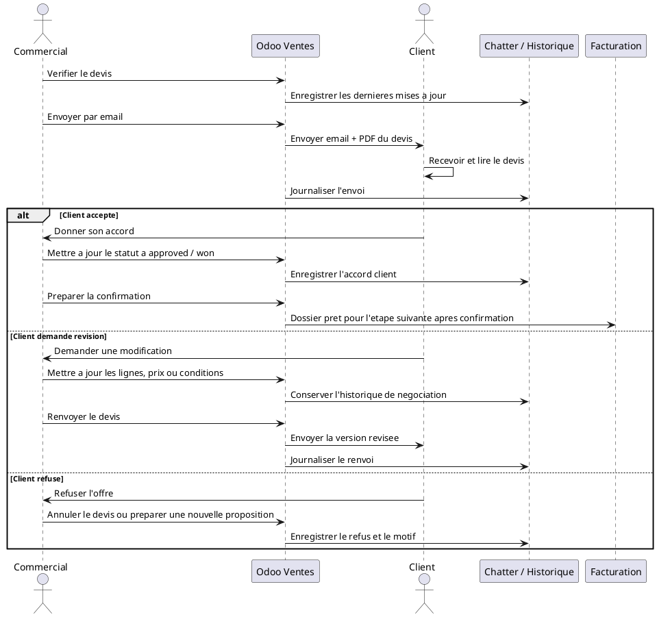

# Envoi, Negociation et Acceptation du Devis dans Odoo 18

## 1. Introduction

L'envoi du devis est une etape commerciale decisive dans le module Ventes. A partir de ce moment, le devis devient le support officiel d'echange entre DigiPlus et le client. Il ne s'agit plus seulement d'une preparation interne : le document est partage, discute, compare et negocie.

A ce stade, la vente n'est pas encore confirmee. Le devis reste une proposition commerciale. Il doit donc permettre au client de comprendre l'offre, de poser ses questions, de demander des ajustements si necessaire, puis de formuler son accord avant toute transformation en commande client.

Dans le contexte DigiPlus, cette etape est essentielle car les ventes portent souvent sur des prestations a forte composante de service : ERP Odoo, CRM, developpement web, formation, support technique, licences Microsoft 365 ou transformation digitale. Le devis doit donc servir a la fois de document commercial, de base de discussion et de trace de decision.

## 2. Preparation avant envoi

Avant d'envoyer un devis, l'equipe commerciale doit verifier qu'il est complet, coherent et presentable.

Les points de controle principaux sont les suivants :

- `Client correct` : verifier que le bon partenaire est selectionne.
- `Adresse correcte` : verifier les adresses de facturation et, si besoin, de livraison.
- `Lignes de devis completes` : chaque ligne doit etre claire et exploitable.
- `Prix unitaires verifies` : les tarifs doivent etre conformes a l'offre negociee.
- `Quantites correctes` : verifier forfaits, jours, licences, sessions ou equipements.
- `TVA correcte` : s'assurer que la fiscalite appliquee est la bonne.
- `Conditions de paiement renseignees` : acompte, echeancier, paiement a terme ou paiement d'avance.
- `Validite du devis renseignee` : la date d'expiration doit etre presente.
- `Termes et conditions ajoutes` : validite, delais, annulation, bon pour accord.
- `Commercial responsable indique` : le proprietaire du dossier doit etre clairement defini.
- `Statut metier coherent` : `draft` ou `in_review` avant l'envoi, selon le niveau de validation interne.

Avant envoi, il est aussi utile de verifier la presentation du PDF DigiPlus pour s'assurer que le document remis au client contient bien :

- le `logo DigiPlus Consulting` ;
- le `numero de devis` ;
- la `date du devis` ;
- la `validite du devis` ;
- le `bloc entreprise` ;
- le `bloc client` ;
- la `description des prestations ou produits` ;
- les colonnes `prix`, `quantite` et `total` ;
- la `TVA` ;
- les `termes et conditions` ;
- la zone de signature `Bon pour accord`.

L'objectif metier est simple : eviter d'envoyer un devis incomplet ou incoherent, qui fragiliserait la relation commerciale ou obligerait a une correction immediate.

## 3. Envoi du devis au client

Une fois les verifications faites, le devis peut etre envoye au client depuis Odoo.

Le processus se deroule ainsi :

- ouvrir le devis ;
- cliquer sur `Envoyer par email` ;
- verifier le modele d'email propose ;
- verifier le destinataire ;
- verifier que le PDF du devis est bien joint ;
- envoyer le message.

Dans votre environnement DigiPlus, un modele d'email de proposition commerciale existe deja pour accompagner cet envoi. Il permet de standardiser la communication client.

### Ce que le systeme genere

L'envoi produit plusieurs traces utiles :

- un `email d'envoi` adresse au client ;
- un `PDF du devis` joint au message ;
- un `historique de communication` conserve dans le chatter ;
- un `changement de statut` vers `Envoye` si la logique d'envoi est appliquee dans le cycle de vente ;
- une mise a jour potentielle du statut metier vers `sent`.

Le devis devient alors un document officiellement transmis au client, et non plus seulement un brouillon interne.

## 4. Suivi du devis envoye

Apres envoi, le travail commercial ne s'arrete pas. Le devis doit etre suivi jusqu'a obtention d'une decision.

L'equipe commerciale peut suivre :

- le `statut du devis` ;
- les `relances client` ;
- le `suivi des echanges` dans le chatter ;
- les `notes internes` ;
- les `activites planifiees` ;
- la `date limite de validite` ;
- la `prochaine action commerciale`.

### Interet metier du suivi

Ce suivi permet de :

- eviter les devis oublies ;
- suivre les opportunites chaudes ;
- relancer avant expiration ;
- garder une trace structuree des echanges ;
- mieux piloter la charge commerciale en cours.

Dans un contexte de demonstration client, cette partie montre bien qu'Odoo ne sert pas seulement a generer un PDF, mais aussi a organiser le cycle de decision autour du devis.

## 5. Negociation avec le client

Apres l'envoi, plusieurs scenarios sont possibles.

### Le client accepte directement

Dans ce cas, le devis n'a pas besoin de modification majeure. Le commercial prepare simplement l'etape de confirmation.

### Le client demande une remise

Le devis doit etre ajuste sur une ou plusieurs lignes, ou sur une logique de geste commercial global. L'impact porte sur le prix unitaire, la remise ou le total general.

### Le client demande une modification de quantite

Le commercial modifie les quantites : nombre de licences, nombre de jours, nombre de sessions, nombre d'equipements ou volume de support.

### Le client demande une modification de perimetre

Le devis est ajuste en profondeur : ajout ou suppression de prestation, lot supplementaire, retrait d'un module, evolution du contenu de mission ou changement du niveau de service.

### Le client demande un delai de paiement

Le devis peut etre revu sur les conditions de paiement : acompte, echeancier, paiement trimestriel, mensualisation ou delai plus long.

### Le client demande une nouvelle version du devis

Le devis est mis a jour puis renvoye. Le dossier commercial continue d'etre suivi dans Odoo avec son historique.

### Le client refuse l'offre

Le devis peut etre annule, et l'opportunite commerciale peut ensuite etre analysee ou marquee comme perdue si necessaire.

## 6. Revision du devis

Tant que le devis n'est pas confirme, il reste modifiable. C'est un point cle du module Ventes.

Le commercial peut notamment :

- modifier les lignes ;
- ajouter ou supprimer une prestation ;
- modifier la quantite ;
- modifier le prix ;
- ajouter une remise ;
- modifier la validite ;
- modifier les conditions de paiement ;
- mettre a jour les termes et conditions ;
- renvoyer le devis au client.

Cette souplesse est particulierement importante chez DigiPlus, ou un devis peut evoluer selon le cadrage final du besoin, le budget du client, les ressources disponibles ou la priorisation des lots.

## 7. Gestion du statut metier DigiPlus `x_decision_status`

En plus du statut standard Odoo, DigiPlus utilise un statut metier complementaire pour piloter finement le cycle de decision.

Les statuts possibles sont :

- `draft` : devis en preparation ;
- `in_review` : devis en revue interne ;
- `sent` : devis envoye au client ;
- `approved` : devis approuve sur le principe ;
- `won` : devis accepte et pret a etre confirme.

### Utilisation pratique de ces statuts

- `draft` pour les devis encore incomplets ;
- `in_review` pour les devis qui doivent etre valides en interne avant envoi ;
- `sent` pour les devis transmis au client ;
- `approved` lorsque le client donne un accord de principe mais qu'il reste une formalisation finale ;
- `won` lorsque la decision est acquise et que la confirmation en commande client peut etre preparee.

Ce statut metier donne une meilleure visibilite a l'equipe commerciale et permet un reporting plus fin que le seul etat standard du document.

## 8. Acceptation du devis par le client

Le client peut accepter le devis de plusieurs manieres :

- signature du devis avec la mention `Bon pour accord` ;
- accord par email ;
- accord oral confirme par le commercial ;
- acceptation via portail client si cette option est activee ;
- paiement d'un acompte si le processus commercial l'utilise comme signal d'accord.

Quelle que soit la forme retenue, l'acceptation client est la condition necessaire avant la confirmation du devis.

En pratique, le commercial doit s'assurer que l'accord est suffisamment clair, tracable et exploitable pour lancer l'etape suivante sans ambiguite.

## 9. Cas de refus du devis

Si le client refuse l'offre :

- le devis peut etre `annule` ;
- le `motif de refus` peut etre note dans le dossier ou dans le suivi commercial ;
- l'`opportunite` peut etre marquee comme perdue si la vente n'a plus de perspective ;
- les `informations restent disponibles` pour l'analyse commerciale future ;
- le commercial peut `preparer une nouvelle proposition` si une relance ou une reformulation reste envisageable.

Le refus n'efface donc pas l'historique. Il alimente au contraire le retour d'experience commercial.

## 10. Condition de passage a la commande client

Le devis ne devient une commande client qu'apres confirmation.

Le workflow est le suivant :

```text
Devis envoye
-> Negociation eventuelle
-> Accord client
-> Confirmation du devis
-> Commande client
```

Cette logique permet de securiser la vente avant de declencher les flux avals vers Projet, Stock ou Facturation.

## 11. Documents et traces generes

Pendant cette phase, Odoo conserve plusieurs elements utiles au suivi :

- le `devis PDF` ;
- l'`email envoye` ;
- les `messages dans le chatter` ;
- les `activites commerciales` ;
- les `notes internes` ;
- les `versions revisees du devis` ;
- le `statut du devis` ;
- la `trace de l'accord client` ;
- l'`historique de negociation`.

Cette capacite de tracabilite est importante pour le pilotage commercial, la qualite de service et la justification des decisions en interne.

## 12. Tableau recapitulatif

| Etape | Acteur | Action | Document ou trace generee | Statut | Etape suivante |
|---|---|---|---|---|---|
| Verification du devis | Commercial | Controle client, lignes, prix, taxes, conditions | Devis verifie | `draft` / `in_review` | Envoi |
| Envoi au client | Commercial | Envoi par email depuis Odoo | Email + PDF + chatter | `Envoye` / `sent` | Suivi |
| Suivi | Commercial | Controle du retour et des echeances | Activites, notes, relances | `sent` | Relance ou negotiation |
| Relance | Commercial | Contact du client avant expiration | Message, appel, activite | `sent` | Decision client |
| Negociation | Commercial + Client | Echange sur prix, quantites, perimetre, delais | Historique de negociation | `sent` / `in_review` | Revision ou accord |
| Revision | Commercial | Mise a jour du devis | Devis revise + PDF renvoye | `in_review` / `sent` | Attente de retour |
| Acceptation | Client | Donne son accord | Email, signature, bon pour accord, acompte | `approved` | Preparation confirmation |
| Refus eventuel | Client / Commercial | Refuse ou abandonne l'offre | Note de refus, annulation, historique | `Annule` | Nouvelle proposition ou cloture |
| Preparation de la confirmation | Commercial | Verifie l'accord final | Dossier pret a convertir | `won` | Commande client |

## 13. Mini-workflow textuel

```text
Devis brouillon
-> Verification interne
-> Envoi au client
-> Devis envoye
-> Suivi commercial
-> Negociation eventuelle
-> Revision si necessaire
-> Accord client
-> Devis approuve
-> Confirmation en commande client
```

## 14. Sequence UML textuelle



## 15. Resume operationnel

Dans Odoo 18, l'envoi du devis marque le debut de la vraie discussion commerciale avec le client. Le devis devient alors le document officiel de reference pour presenter l'offre, son prix, ses conditions et sa validite. L'equipe commerciale peut l'envoyer par email, suivre les relances, consigner les echanges et planifier les prochaines actions. Si le client demande un ajustement, le devis reste modifiable tant qu'il n'est pas confirme. Odoo conserve l'historique des revisions, des messages et des accords. Quand le client accepte, DigiPlus peut qualifier le devis comme approuve puis gagne, avant de le confirmer en commande client. Cette etape permet donc de securiser la vente avant d'engager la livraison, le projet ou la facturation.
