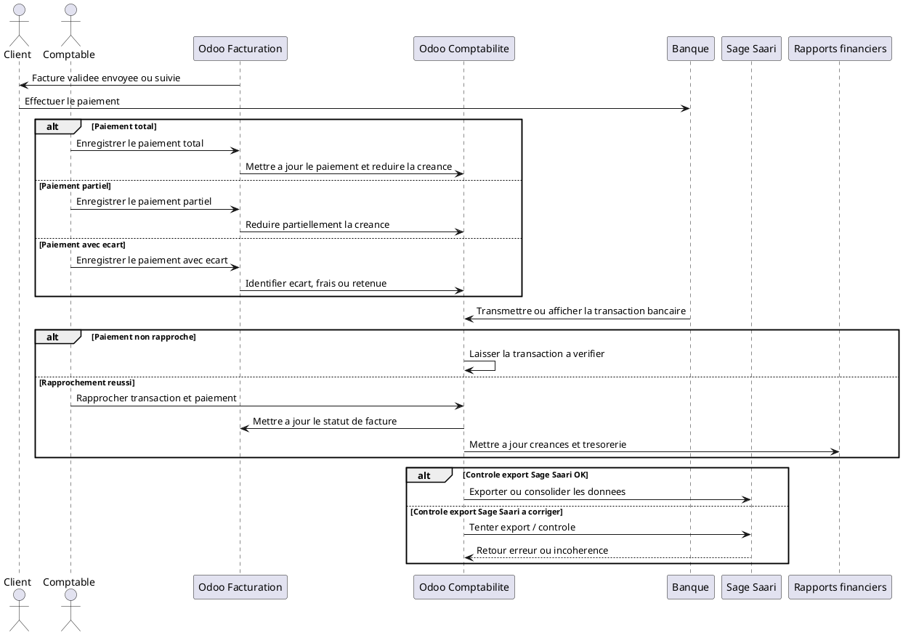

# Paiement Client, Banque et Rapprochement Bancaire dans Odoo 18

## 1. Introduction

Le paiement client intervient apres la validation de la facture. A ce stade, la facture est bien officielle sur le plan comptable, mais cela ne signifie pas encore que l'argent a ete recu.

Une facture validee n'est donc pas forcement payee. Elle devient reellement soldee lorsque le reglement est enregistre, puis rattache a une transaction bancaire coherente.

Dans Odoo, le paiement et le rapprochement bancaire servent a fermer la boucle financiere : la facture cree la creance, le paiement la reduit, et le rapprochement bancaire confirme que le mouvement existe bien sur le compte bancaire reel.

## 2. Point de depart

Le processus commence avec une facture validee et non payee.

Le workflow general est le suivant :

```text
Facture validee
-> Creance client ouverte
-> Paiement attendu
-> Reglement recu
-> Enregistrement du paiement
-> Rapprochement bancaire
-> Facture payee
```

La facture est donc deja en comptabilite, mais la creance reste ouverte tant que l'encaissement n'est pas traite correctement.

## 3. Difference entre facture validee et facture payee

### Facture validee

Une facture validee est :

- une facture officielle ;
- une ecriture comptable deja creee ;
- une creance client deja enregistree ;
- un montant du par le client ;
- un paiement encore attendu.

### Facture payee

Une facture payee correspond a une situation ou :

- le paiement a ete recu ;
- la creance est soldee ;
- le statut de paiement est mis a jour ;
- la banque est rapprochee si le releve bancaire est traite ;
- le dossier financier est clos ou presque clos.

La difference cle est donc simple : `validee` signifie `facturee`, tandis que `payee` signifie `encaissee et soldee`.

## 4. Moyens de paiement possibles

Les moyens de paiement courants a gerer dans Odoo sont :

- `Virement bancaire`
- `Especes`
- `Cheque`
- `Mobile Money`
- `Paiement en ligne` si active
- `Paiement partiel`
- `Paiement multiple`
- `Paiement anticipe ou acompte`

### Adaptation au contexte DigiPlus

- le `virement bancaire` reste le mode principal pour les clients entreprises ;
- `Mobile Money` peut etre utile pour certains clients locaux ou petits reglements ;
- le `paiement partiel` est frequent pour les prestations longues ;
- l'`acompte` est courant pour les projets ERP, web ou formation.

Dans Odoo, ces moyens de paiement sont rattaches a des journaux et methodes de paiement adaptes au mode d'encaissement retenu.

## 5. Enregistrement du paiement depuis la facture

L'enregistrement du paiement depuis la facture suit la logique suivante :

- ouvrir la facture validee ;
- cliquer sur `Enregistrer un paiement` ;
- choisir le journal de paiement ;
- renseigner le montant paye ;
- renseigner la date du paiement ;
- choisir le moyen de paiement ;
- valider le paiement.

Cette action permet d'associer un paiement a la facture et de constater que le client a regle tout ou partie du montant.

## 6. Effet de l'enregistrement du paiement

Apres enregistrement, Odoo peut :

- creer un `paiement client` ;
- mettre a jour le `statut de la facture` ;
- reduire ou solder la `creance client` ;
- preparer le `rapprochement avec la banque` ;
- mettre a jour les `rapports de paiement`.

Les cas possibles sont :

- `Paiement total` : la facture peut aller vers un statut paye une fois le flux bancaire confirme ;
- `Paiement partiel` : la facture reste partiellement ouverte ;
- `Paiement superieur` : un ecart, un trop-percu ou un avoir doit etre gere ;
- `Paiement non rapproche` : le paiement est enregistre, mais la banque doit encore le confirmer.

Dans la configuration Odoo recommandee avec comptes d'attente ou rapprochement bancaire, l'enregistrement du paiement prepare la cloture, mais le rapprochement bancaire reste l'etape de securisation finale.

## 7. Statuts de paiement

Les statuts fonctionnels a suivre sont :

- `Non payee`
- `Partiellement payee`
- `En paiement`
- `Payee`
- `En retard`
- `Annulee` si la facture elle-meme est annulee

### Interet metier de ces statuts

Ils permettent de :

- suivre les creances clients ;
- relancer les impayes ;
- analyser la tresorerie ;
- identifier les factures a encaisser ;
- controler les ecarts de paiement.

Le statut `En retard` est surtout une lecture de gestion basee sur l'echeance depassee et le montant restant du.

## 8. Banque et releves bancaires

Le module Banque dans Odoo sert a suivre les flux reels qui transitent sur les comptes bancaires.

Il permet de :

- suivre les encaissements ;
- importer ou synchroniser les releves bancaires ;
- comparer les transactions bancaires avec les paiements enregistres ;
- rapprocher les lignes bancaires avec les factures ;
- securiser la tresorerie.

Les sources possibles sont :

- `import manuel de releve bancaire` ;
- `connexion bancaire` si configuree ;
- `saisie manuelle d'une transaction` ;
- `import de fichier bancaire` ;
- `releve genere par la banque`.

## 9. Rapprochement bancaire

Definition simple :
Le rapprochement bancaire consiste a faire correspondre une transaction reellement recue sur le compte bancaire avec une facture ou un paiement deja enregistre dans Odoo.

Le workflow est le suivant :

```text
Transaction bancaire recue
-> Recherche de la facture ou du paiement correspondant
-> Correspondance montant / client / reference
-> Validation du rapprochement
-> Creance soldee
-> Facture marquee payee
```

Le rapprochement est donc l'etape qui confirme que le paiement constate dans Odoo correspond bien a un mouvement bancaire reel.

## 10. Controles pendant le rapprochement

Pendant le rapprochement, il faut verifier :

- le `montant recu` ;
- le `client concerne` ;
- la `reference de facture` ;
- la `date de paiement` ;
- le `compte bancaire` ;
- le `journal bancaire` ;
- l'`ecart eventuel` ;
- les `frais bancaires eventuels` ;
- le `paiement partiel eventuel` ;
- la `devise` si paiement en devise etrangere.

Ces controles evitent de solder une facture avec la mauvaise transaction ou de masquer un ecart non justifie.

## 11. Cas de paiement partiel

Le paiement partiel fonctionne ainsi :

- le client paie une partie du montant ;
- Odoo reduit la creance ;
- la facture reste ouverte pour le solde ;
- le statut devient `Partiellement payee` ;
- le solde reste a relancer.

### Exemple

```text
Facture : 1 000 000 FCFA
Paiement recu : 400 000 FCFA
Solde restant : 600 000 FCFA
Statut : Partiellement payee
```

Ce cas est frequent pour les projets en plusieurs tranches ou les clients qui reglent par etapes.

## 12. Cas de paiement total

Le paiement total fonctionne ainsi :

- le client paie le montant total ;
- Odoo solde la creance ;
- la facture passe au statut `Payee` ;
- le rapprochement bancaire cloture le cycle financier.

### Exemple

```text
Facture : 1 000 000 FCFA
Paiement recu : 1 000 000 FCFA
Solde restant : 0 FCFA
Statut : Payee
```

Le dossier passe alors d'une logique de recouvrement a une logique d'historique financier clos.

## 13. Cas d'ecart de paiement

Plusieurs ecarts peuvent se presenter :

- `Frais bancaires`
- `Erreur de montant`
- `Trop-percu`
- `Paiement incomplet`
- `Retenue a la source`
- `Remise exceptionnelle`
- `Difference de change` si devise etrangere

Ces ecarts doivent etre justifies comptablement avant cloture. Le rapprochement peut alors inclure une operation manuelle, un write-off, un compte d'ecart ou un traitement complementaire selon la politique comptable retenue.

## 14. Lien avec la Comptabilite

Le paiement et le rapprochement mettent a jour :

- le `compte client` ;
- le `compte bancaire` ;
- le `journal de banque` ;
- le `statut de la facture` ;
- la `balance agee client` ;
- les `rapports de tresorerie` ;
- les `creances ouvertes`.

Le workflow comptable simplifie est le suivant :

```text
Facture validee
-> Creance client
-> Paiement recu
-> Banque debitee ou creditee selon le journal
-> Creance soldee
-> Facture payee
```

Le point cle est que la comptabilite ne suit pas seulement la facture : elle suit aussi l'encaissement reel et sa coherence avec la banque.

## 15. Lien avec Sage Saari

Dans le contexte DigiPlus, selon l'organisation retenue :

- la `facture validee` peut etre exportee vers Sage Saari ;
- le `paiement` peut aussi etre suivi pour assurer la coherence de bout en bout ;
- le `statut d'export` doit eviter les doubles traitements ;
- les `ecarts` doivent etre controles avant export ou consolidation.

Les statuts utiles peuvent etre presentes ainsi :

- `Paiement non exporte`
- `Paiement pret a exporter`
- `Paiement exporte`
- `Erreur d'export`
- `A controler`

Dans votre environnement, le suivi natif visible porte surtout sur le statut d'export de la facture. Pour la demonstration, il est pertinent d'expliquer que le meme principe de controle peut etre etendu au suivi du paiement ou a la consolidation dans Sage.

## 16. Documents et traces generes

Le cycle de paiement cree ou met a jour :

- `Paiement client`
- `Ecriture de paiement`
- `Ligne bancaire`
- `Rapprochement bancaire`
- `Statut de facture mis a jour`
- `Compte client solde ou partiellement solde`
- `Historique dans le chatter`
- `Rapport de paiement`
- `Rapport de tresorerie`
- `Balance agee client mise a jour`

Ces elements permettent de suivre la vente jusqu'a l'encaissement reel.

## 17. Tableau recapitulatif

| Etape | Acteur | Action | Document ou ecriture generee | Statut | Impact comptable | Etape suivante |
|---|---|---|---|---|---|---|
| Facture validee | Comptable / ADV | Laisse la facture ouverte au recouvrement | Facture comptabilisee | `Not Paid` ou equivalent | Creance client ouverte | Paiement attendu |
| Paiement attendu | Client / Commercial / Comptable | Suit l'echeance et les relances | Suivi de creance | En attente | Aucun nouveau mouvement tant que non regle | Paiement recu |
| Paiement recu | Client | Effectue le reglement | Mouvement attendu | A identifier | Encaissement externe a integrer | Enregistrement du paiement |
| Enregistrement du paiement | Comptable | Enregistre le reglement dans Odoo | Paiement client | `In Payment` ou reduction du solde | Diminution de la creance / mouvement de paiement | Banque |
| Paiement partiel ou total | Odoo Comptabilite | Met a jour le solde de la facture | Solde residuel ou solde nul | `Partial` / `Paid` selon cas | Creance partiellement ou totalement soldee | Rapprochement |
| Import ou saisie du releve bancaire | Comptable | Charge la transaction bancaire | Ligne bancaire | A rapprocher | Mouvement bancaire en attente | Rapprochement bancaire |
| Rapprochement bancaire | Comptable | Fait correspondre paiement et banque | Rapprochement valide | Rapproche | Confirmation du solde reel | Facture payee |
| Facture payee | Odoo Facturation / Comptabilite | Met a jour le statut final | Facture soldee | `Paid` | Creance fermee | Rapports |
| Mise a jour des rapports | Odoo Comptabilite | Actualise la tresorerie et les creances | Rapports financiers | A jour | Vision fiable du cash et des impayes | Pilotage |
| Controle export Sage Saari | Comptable / Integration | Controle coherence de transmission | Statut d'export / de controle | `ready` / `exported` / `error` | Coherence inter-systemes | Consolidation |

## 18. Mini-workflow textuel

```text
Facture validee
-> Paiement attendu
-> Client paie
-> Enregistrement du paiement
-> Banque recoit la transaction
-> Rapprochement bancaire
-> Creance soldee
-> Facture payee
-> Rapports financiers mis a jour
```

## 19. Sequence UML textuelle



## 20. Points de vigilance

Erreurs a eviter :

- confondre facture validee et facture payee ;
- enregistrer un paiement sur la mauvaise facture ;
- utiliser le mauvais journal de paiement ;
- ne pas verifier le montant recu ;
- ne pas traiter les paiements partiels ;
- ignorer les frais bancaires ;
- rapprocher une transaction avec le mauvais client ;
- oublier les factures en retard ;
- ne pas controler les ecarts de paiement ;
- exporter des donnees incoherentes vers Sage Saari ;
- ne pas suivre la balance agee client.

## 21. Cas pratique DigiPlus

### Cas 1 : Implementation Odoo + formation utilisateurs

Client : entreprise professionnelle  
Besoin : implementation Odoo + formation utilisateurs  
Facture : acompte de demarrage de 40 %  
Montant facture : 1 000 000 FCFA  
Paiement recu : 1 000 000 FCFA par virement bancaire

Workflow :

```text
Facture validee
-> Paiement attendu
-> Client effectue le virement
-> Comptable enregistre le paiement
-> Banque confirme la transaction
-> Rapprochement bancaire
-> Facture marquee payee
-> Creance soldee
-> Rapports financiers mis a jour
```

Lecture fonctionnelle :

- la facture est deja comptabilisee ;
- le comptable enregistre ensuite le virement recu ;
- la transaction bancaire est chargee ou synchronisee ;
- le rapprochement confirme que le virement correspond bien a la facture ;
- la facture passe a l'etat paye.

### Cas 2 : Support technique mensuel

Client : PME  
Besoin : support technique mensuel  
Facture : 150 000 FCFA  
Paiement recu : 75 000 FCFA  
Statut : Partiellement payee  
Solde restant : 75 000 FCFA  
Action suivante : relance client ou suivi d'echeance

Lecture fonctionnelle :

- une partie de la creance est soldee ;
- la facture reste ouverte pour le solde ;
- le suivi client continue jusqu'au reglement complet.

## 22. Resume operationnel

Dans Odoo, le paiement client permet de solder une facture validee, mais seulement lorsque le reglement est correctement traite. Le comptable peut enregistrer le paiement depuis la facture ou rapprocher une transaction bancaire recue. Lorsque le montant recu correspond a la facture, Odoo met a jour le statut de paiement, reduit ou solde la creance client et actualise les rapports financiers. Si le paiement est partiel ou comporte un ecart, la facture reste ouverte jusqu'a regularisation. Le rapprochement bancaire est donc l'etape qui securise la coherence entre la facture, le paiement et le compte bancaire reel. Dans le contexte DigiPlus, cette etape peut aussi s'accompagner d'un controle de coherence avec Sage Saari.
