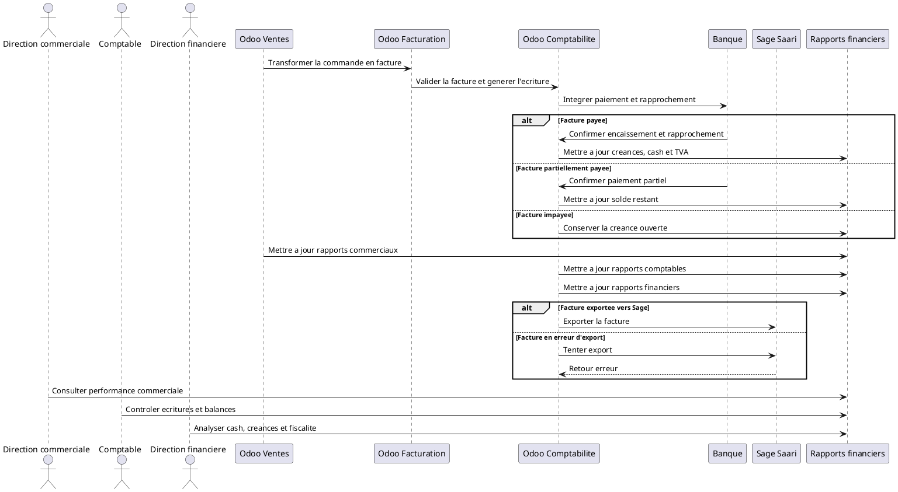

# Rapports Commerciaux, Comptables et Financiers Apres Vente dans Odoo 18

## 1. Introduction

Les rapports representent la derniere etape du cycle `Vente -> Facturation -> Comptabilite -> Banque`. Une fois la commande, la facture, le paiement et le rapprochement bancaire traites, Odoo peut transformer toutes ces operations en informations de pilotage.

Ces rapports permettent a l'entreprise de suivre :

- le chiffre d'affaires ;
- les factures ;
- les paiements ;
- les creances clients ;
- la tresorerie ;
- la TVA ;
- la rentabilite.

Dans DigiPlus, ils servent a la fois a la direction commerciale, a la direction financiere et a la comptabilite.

## 2. Point de depart

Les rapports sont alimentes progressivement par plusieurs documents et ecritures :

- le `devis` ;
- la `commande client` ;
- la `facture validee` ;
- l'`ecriture comptable` ;
- le `paiement` ;
- le `rapprochement bancaire`.

Le workflow se lit ainsi :

```text
Devis
-> Commande client
-> Facture validee
-> Paiement
-> Rapprochement bancaire
-> Rapports mis a jour
```

La qualite des rapports depend donc directement de la qualite du traitement en amont.

## 3. Difference entre rapports commerciaux, comptables et financiers

### Rapports commerciaux

Ils servent a suivre la performance des ventes :

- suivi des devis ;
- suivi des commandes ;
- chiffre d'affaires commercial ;
- performance des commerciaux ;
- taux de conversion ;
- ventes par client, service ou produit.

### Rapports comptables

Ils servent a suivre les ecritures et les comptes :

- journal de vente ;
- ecritures comptables ;
- balance agee client ;
- grand livre client ;
- TVA collectee ;
- comptes de produits ;
- creances clients.

### Rapports financiers

Ils servent a piloter la situation financiere reelle :

- tresorerie ;
- encaissements ;
- factures payees et impayees ;
- tableau de bord financier ;
- etats financiers SYSCOHADA selon configuration ;
- analyse des flux de paiement.

En resume :

- le `commercial` regarde l'activite de vente ;
- la `comptabilite` regarde les ecritures et les comptes ;
- la `finance` regarde le cash, les soldes, le risque et les decisions de gestion.

## 4. Rapports commerciaux apres vente

Apres vente, le module Vente permet d'analyser notamment :

- les `devis envoyes` ;
- les `devis gagnes` ;
- les `devis perdus` ;
- les `commandes confirmees` ;
- le `chiffre d'affaires par commercial` ;
- le `chiffre d'affaires par client` ;
- le `chiffre d'affaires par produit ou service` ;
- le `chiffre d'affaires par periode` ;
- le `taux de transformation devis -> commande` ;
- l'`analyse des ventes par equipe commerciale`.

### Adaptation aux cas DigiPlus

Ces rapports peuvent etre lus par famille d'offres :

- ventes `ERP Odoo` ;
- ventes `CRM` ;
- ventes `sites web` ;
- ventes `formations` ;
- ventes `support technique` ;
- ventes `licences Microsoft 365` ;
- ventes `materiel informatique`.

Dans votre depot, les donnees BI montrent deja une lecture par axe commercial comme `CRM`, `BI`, `ERP` et `Support`, avec chiffre d'affaires, taux de conversion et taux de marge.

## 5. Rapports de facturation

Les rapports lies aux factures clients permettent de suivre :

- les `factures brouillon` ;
- les `factures validees` ;
- les `factures annulees` ;
- les `factures payees` ;
- les `factures partiellement payees` ;
- les `factures impayees` ;
- les `factures en retard` ;
- les `factures par client` ;
- les `factures par commercial` ;
- les `factures par periode` ;
- les `factures avec statut d'export Sage Saari`.

### Interet metier

Ces rapports servent a :

- suivre ce qui a ete reellement facture ;
- identifier les factures non payees ;
- preparer les relances ;
- controler les factures a exporter vers Sage Saari ;
- securiser le suivi du chiffre d'affaires comptabilise.

## 6. Rapports comptables

Apres validation des factures et traitement des paiements, Odoo produit ou alimente notamment :

- le `journal de vente` ;
- le `grand livre` ;
- la `balance generale` ;
- la `balance auxiliaire client` ;
- la `balance agee client` ;
- les `ecritures comptables` ;
- les `comptes de produits` ;
- les `comptes de TVA` ;
- les `comptes clients` ;
- le `lettrage des comptes tiers` ;
- le `suivi des creances clients`.

Ces rapports sont alimentes principalement par :

- les `factures validees` ;
- les `paiements enregistres` ;
- les `rapprochements bancaires`.

## 7. Balance agee client et suivi des impayes

Definition simple :
La balance agee client permet de voir les montants dus par les clients selon leur anciennete.

Les categories classiques sont :

- `Non echues`
- `0 a 30 jours`
- `31 a 60 jours`
- `61 a 90 jours`
- `Plus de 90 jours`

### Interet metier

Elle permet de :

- identifier les retards de paiement ;
- prioriser les relances ;
- evaluer le risque client ;
- ameliorer la tresorerie ;
- reduire les creances douteuses.

Dans Odoo, c'est l'un des rapports les plus utiles pour la direction financiere et la comptabilite.

## 8. Rapports de TVA et fiscalite

Les rapports lies a la TVA permettent de suivre :

- la `TVA collectee sur les ventes` ;
- la `base taxable` ;
- le `montant de TVA par periode` ;
- les `factures avec TVA` ;
- les `factures exonerees` ;
- les `positions fiscales` ;
- la `preparation des declarations fiscales`.

### Adaptation au contexte SYSCOHADA

Dans un contexte SYSCOHADA, ces rapports servent a :

- assurer une comptabilisation coherente des taxes ;
- suivre les comptes de TVA ;
- preparer les elements fiscaux ;
- controler les ecritures avant declaration.

La production exacte depend de la localisation comptable et du parametrage fiscal installes dans la base.

## 9. Etats financiers SYSCOHADA

Les ecritures issues des ventes et des paiements alimentent les etats financiers.

Les etats concernes sont notamment :

- le `compte de resultat` ;
- le `bilan` ;
- la `balance generale` ;
- le `grand livre` ;
- le `journal comptable` ;
- le `tableau de tresorerie` si configure ;
- les `etats financiers reglementaires SYSCOHADA` selon configuration.

La vente n'est pas la seule source de ces etats, mais elle alimente fortement :

- le `chiffre d'affaires` ;
- les `creances clients` ;
- la `TVA collectee` ;
- les `encaissements` ;
- les `comptes de produits`.

## 10. Rapports de tresorerie et banque

Les rapports lies aux paiements et a la banque couvrent notamment :

- les `encaissements clients` ;
- les `paiements recus` ;
- les `paiements en attente` ;
- les `transactions bancaires` ;
- les `rapprochements bancaires` ;
- le `solde bancaire` ;
- les `flux de tresorerie` ;
- les `previsions d'encaissement` ;
- les `ecarts de paiement` ;
- les `frais bancaires eventuels`.

Le rapprochement bancaire fiabilise ces rapports, car il confirme la coherence entre les paiements declares et les transactions bancaires reelles.

## 11. Tableau de bord financier

Un tableau de bord financier utile peut afficher :

- le `chiffre d'affaires du mois` ;
- le `chiffre d'affaires cumule` ;
- les `factures payees` ;
- les `factures impayees` ;
- le `montant des creances clients` ;
- le `montant encaisse` ;
- le `montant restant a encaisser` ;
- la `TVA collectee` ;
- les `top clients` ;
- les `top services vendus` ;
- les `retards de paiement` ;
- le `taux de recouvrement` ;
- les `factures a exporter vers Sage Saari` ;
- les `factures en erreur d'export`.

Dans votre environnement DigiPlus, le modele `digiplus.dashboard.metric` et le menu `Pilotage executif` / `Reporting & BI` vont deja dans cette direction.

## 12. Rapports utiles a la direction financiere

La direction financiere doit en priorite consulter :

- la `situation des creances clients` ;
- le `suivi des encaissements` ;
- les `factures en retard` ;
- l'`evolution du chiffre d'affaires` ;
- la `prevision de tresorerie` ;
- la `TVA collectee` ;
- la `balance agee client` ;
- l'`etat des rapprochements bancaires` ;
- les `factures non exportees vers Sage Saari` ;
- le `tableau de bord financier global`.

Ces rapports servent a piloter la liquidite, le risque client et la fiabilite comptable.

## 13. Rapports utiles a la direction commerciale

La direction commerciale doit surtout suivre :

- les `devis envoyes` ;
- les `devis acceptes` ;
- le `taux de conversion` ;
- les `commandes confirmees` ;
- le `chiffre d'affaires par commercial` ;
- le `chiffre d'affaires par type de service` ;
- les `clients les plus rentables` ;
- les `services les plus vendus` ;
- les `opportunites gagnees transformees en commandes` ;
- les `devis bloques ou expires`.

Pour DigiPlus, ces vues sont particulierement utiles pour arbitrer entre ERP, CRM, support, BI, web et licences.

## 14. Rapports utiles a la comptabilite

L'equipe comptable doit consulter en priorite :

- les `factures validees` ;
- les `factures non payees` ;
- les `factures partiellement payees` ;
- le `journal de vente` ;
- la `balance client` ;
- le `lettrage des comptes tiers` ;
- la `TVA collectee` ;
- les `paiements enregistres` ;
- les `rapprochements bancaires` ;
- les `ecritures a controler` ;
- les `exports Sage Saari`.

Ces rapports servent a garantir que les documents commerciaux sont bien traduits en ecritures comptables coherentes.

## 15. Lien avec Sage Saari

Dans le contexte DigiPlus, le reporting doit permettre de suivre :

- les `factures non exportees` ;
- les `factures pretes a exporter` ;
- les `factures exportees` ;
- les `factures en erreur` ;
- les `paiements eventuellement exportables` ;
- les `ecarts entre Odoo et Sage Saari`.

### Interet metier

Ce suivi permet de :

- eviter les doubles exports ;
- garantir la coherence comptable ;
- faciliter le controle par la direction financiere ;
- securiser la transition entre Odoo et Sage Saari.

Dans votre environnement, ce suivi s'appuie deja sur `x_sage_saari_export_status`.

## 16. Documents, donnees et indicateurs generes

Apres vente, Odoo produit ou met a jour notamment :

- les `rapports de vente` ;
- les `rapports de facturation` ;
- le `journal de vente` ;
- la `balance agee client` ;
- le `grand livre` ;
- la `balance generale` ;
- le `rapport TVA` ;
- le `rapport de tresorerie` ;
- le `tableau de bord financier` ;
- les `etats financiers SYSCOHADA` selon configuration ;
- le `statut d'export Sage Saari` ;
- la `liste des factures impayees` ;
- la `liste des paiements rapproches`.

## 17. Tableau recapitulatif

| Rapport | Source des donnees | Utilisateur concerne | Objectif | Decision possible |
|---|---|---|---|---|
| Rapport des ventes | Devis, commandes, lignes de vente | Direction commerciale | Mesurer l'activite commerciale | Prioriser les offres et equipes |
| Rapport des devis | Devis crees, envoyes, gagnes, perdus | Direction commerciale | Suivre la conversion | Renforcer relances ou arbitrages |
| Rapport des commandes | Commandes confirmees | Direction commerciale, ADV | Mesurer les ventes engagees | Prevoir execution et charge |
| Rapport des factures | Factures brouillon, validees, payees, impayees | Comptabilite, finance | Suivre la facturation reelle | Relancer, controler, exporter |
| Balance agee client | Factures ouvertes et echeances | Comptabilite, finance | Mesurer les impayes par anciennete | Prioriser le recouvrement |
| Journal de vente | Factures validees et ecritures | Comptabilite | Controler les ventes comptabilisees | Verifier chiffre d'affaires et TVA |
| Rapport TVA | Taxes des factures validees | Comptabilite, finance | Preparer la fiscalite | Controler declaration et comptes de taxes |
| Rapport de tresorerie | Paiements, banque, rapprochements | Finance, comptabilite | Suivre les encaissements reels | Piloter liquidite et previsions |
| Tableau de bord financier | Ventes, factures, paiements, banque | Direction financiere | Voir les KPI de synthese | Arbitrer cash, recouvrement, priorites |
| Etats financiers SYSCOHADA | Ecritures comptables consolidees | Direction financiere, comptabilite | Produire les etats reglementaires | Cloture, analyse et communication financiere |
| Suivi export Sage Saari | Statut d'export des factures et controles | Comptabilite, finance | Securiser l'integration externe | Corriger erreurs et eviter doublons |

## 18. Mini-workflow textuel

```text
Commande client
-> Facture validee
-> Ecriture comptable
-> Paiement enregistre
-> Rapprochement bancaire
-> Mise a jour des creances
-> Mise a jour des rapports commerciaux
-> Mise a jour des rapports comptables
-> Mise a jour des rapports financiers
-> Decision de gestion
```

## 19. Sequence UML textuelle



## 20. Points de vigilance

Erreurs a eviter :

- se baser uniquement sur les devis pour calculer le chiffre d'affaires comptable ;
- confondre commande confirmee et facture validee ;
- confondre facture validee et facture payee ;
- ne pas suivre les factures impayees ;
- ne pas controler les paiements partiels ;
- oublier la TVA ;
- ne pas rapprocher les paiements bancaires ;
- ne pas verifier les ecarts entre Odoo et Sage Saari ;
- negliger la balance agee client ;
- ne pas former les utilisateurs aux rapports financiers ;
- mal parametrer les tableaux de bord ;
- utiliser des donnees non validees pour les decisions financieres.

## 21. Cas pratique DigiPlus

### Cas 1 : Implementation Odoo + formation utilisateurs

Client : entreprise professionnelle  
Besoin : implementation Odoo + formation utilisateurs  
Commande client : confirmee  
Facture : validee  
Paiement : acompte recu et rapproche

Rapports mis a jour :

- `chiffre d'affaires facture` ;
- `creance restante` ;
- `paiement recu` ;
- `solde a encaisser` ;
- `TVA collectee` ;
- `etat de paiement` ;
- `statut d'export Sage Saari` ;
- `tableau de bord financier`.

Lecture fonctionnelle :

- la commande nourrit la vision commerciale ;
- la facture validee nourrit la vision comptable ;
- le paiement rapproche nourrit la vision financiere reelle.

### Cas 2 : Support technique mensuel

Client : PME  
Besoin : support technique mensuel  
Facture : partiellement payee

Rapports mis a jour :

- `facture partiellement payee` ;
- `solde restant du` ;
- `client a relancer` ;
- `impact sur la balance agee` ;
- `prevision d'encaissement`.

Lecture fonctionnelle :

- le revenu facture existe deja ;
- le cash n'est pas encore integralement encaisse ;
- la finance doit donc suivre a la fois le chiffre d'affaires et le solde restant.

## 22. Resume operationnel

Les rapports apres vente permettent a l'entreprise de transformer les operations commerciales en informations de pilotage. Le devis et la commande donnent une vision commerciale, tandis que la facture validee donne une vision comptable. Le paiement et le rapprochement bancaire donnent une vision financiere reelle. Odoo permet ainsi de suivre le chiffre d'affaires, les creances, les paiements, la TVA, les impayes, la tresorerie et les etats financiers. Pour DigiPlus, ces rapports servent aussi a controler les factures a exporter vers Sage Saari et a securiser la gestion financiere. La valeur du systeme ne vient donc pas seulement de la vente, mais de la capacite a convertir chaque vente en indicateurs fiables pour decider.
