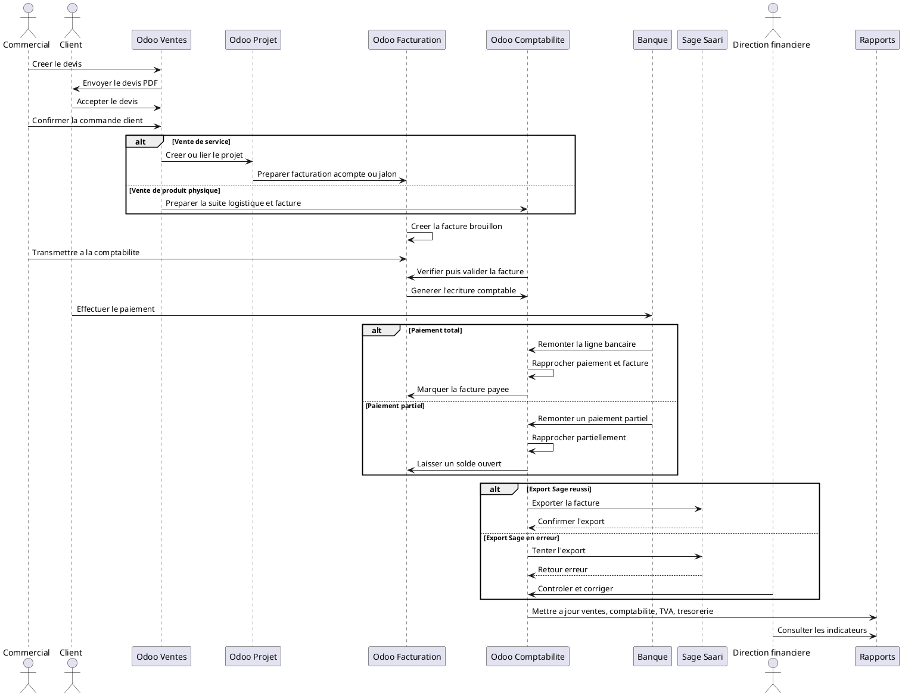

# Scenario Complet de Test et de Demonstration du Workflow Odoo 18

## 1. Introduction

Ce scenario sert a valider le fonctionnement complet du cycle commercial et financier dans Odoo, depuis la vente jusqu'aux rapports financiers. Il peut etre utilise a la fois pour :

- une demonstration client ;
- une recette fonctionnelle interne ;
- une validation avant mise en production.

L'objectif n'est pas seulement de montrer des ecrans, mais de verifier qu'une opportunite qualifiee devient bien :

```text
Devis
-> Commande client
-> Facture
-> Ecriture comptable
-> Paiement
-> Rapprochement bancaire
-> Rapports financiers
```

Dans DigiPlus, ce scenario doit aussi montrer le suivi des statuts Sage Saari et la coherence des droits d'acces.

Note pratique :
les donnees demo du depot ne chargent pas exactement `AGROCHEM` et `PME Support`. Ce document les utilise comme jeu de donnees cible a preparer avant la demonstration. Le depot contient deja des exemples proches sur `sale.order`, `account.move`, `res.partner`, `stock.picking` et `digiplus.dashboard.metric`.

## 2. Objectifs du scenario de test

Le scenario doit permettre de verifier que :

- le devis est correctement cree ;
- le devis devient une commande client ;
- la commande declenche la facturation ;
- la facture brouillon peut etre controlee ;
- la facture validee genere les ecritures comptables ;
- le paiement solde correctement la creance ;
- le rapprochement bancaire fonctionne ;
- les rapports sont mis a jour ;
- l'export Sage Saari est correctement suivi ;
- les droits d'acces sont respectes.

## 3. Donnees de demonstration a preparer

### 3.1 Clients de test

#### Client principal

- Nom : `AGROCHEM`
- Type : `Entreprise`
- Ville : `Douala`
- Secteur : `Distribution de produits agrochimiques et solutions industrielles`
- Besoin : `Implementation Odoo + formation utilisateurs + support`

#### Client secondaire

- Nom : `PME Support`
- Type : `Entreprise`
- Ville : `Douala`
- Secteur : `Services`
- Besoin : `Licence Microsoft 365 + support mensuel`

### 3.2 Produits et services a creer

- `Implementation Odoo`
- `Formation utilisateurs`
- `Support technique mensuel`
- `Licence Microsoft 365 Business`
- `Site web professionnel`
- `Materiel informatique`

### 3.3 Conditions commerciales a parametrer

- paiement par acompte ;
- paiement total ;
- paiement partiel ;
- facturation mensuelle ;
- facturation au jalon.

### 3.4 Comptabilite a verifier

- journal de vente ;
- journal de banque ;
- compte client ;
- compte de produit ;
- compte de TVA collectee ;
- compte bancaire ;
- statut export Sage Saari.

### 3.5 Observation utile pour cette base

Le depot fournit deja :

- des services comme `Implementation Odoo ERP`, `Formation utilisateurs Odoo`, `Maintenance et support applicatif` ;
- des factures demo avec `x_sage_saari_export_status` a `ready` et `exported` ;
- des dashboards `Pilotage executif` et `Reporting & BI`.

En revanche, pour ce scenario il faut ajouter explicitement :

- le partenaire `AGROCHEM` ;
- le partenaire `PME Support` ;
- le produit physique `Routeur` ou `Materiel informatique` si le cas Stock doit etre montre.

## 4. Scenario principal : vente de prestation Odoo

### Donnees de base

- Client : `AGROCHEM`
- Besoin : `Implementation Odoo + formation utilisateurs`
- Montant total : `2 500 000 FCFA`
- Facturation : `acompte de 40 %`, puis `solde apres execution`
- Paiement : `virement bancaire`
- Export : `facture prete pour Sage Saari`

### Workflow attendu

```text
Opportunite CRM gagnee
-> Devis cree
-> Devis envoye
-> Devis accepte
-> Commande client confirmee
-> Projet lie si necessaire
-> Facture d'acompte creee
-> Facture validee
-> Ecriture comptable generee
-> Paiement client recu
-> Rapprochement bancaire
-> Facture payee
-> Rapports mis a jour
-> Statut export Sage Saari controle
```

### Resultat metier attendu

Ce scenario doit montrer qu'Odoo sait convertir une vente de service en :

- engagement commercial ;
- document financier ;
- ecriture comptable ;
- encaissement rapproche ;
- information de pilotage.

## 5. Etape 1 : creation du devis

**Acteur**  
Commercial

**Ecran Odoo**  
`Ventes -> Devis -> Nouveau`

**Action utilisateur**

- creer un nouveau devis ;
- choisir le client `AGROCHEM` ;
- ajouter les lignes de prestation ;
- renseigner validite, taxes et conditions de paiement.

**Donnees a renseigner**

- client ;
- adresse de facturation ;
- date du devis ;
- date de validite ;
- ligne `Implementation Odoo` ;
- ligne `Formation utilisateurs` ;
- quantites ;
- prix ;
- taxes ;
- condition de paiement `Acompte 40 %`.

**Document genere**

- `Devis DigiPlus`

**Statut attendu**

- `Brouillon`
- dans votre environnement DigiPlus, `x_decision_status` doit rester en logique initiale du type `draft` ou `in_review` selon le process retenu.

**Resultat attendu**

- le devis est complet et pret a etre envoye ;
- les montants sont corrects ;
- la TVA est visible si configuree ;
- le PDF peut etre genere.

## 6. Etape 2 : envoi et acceptation du devis

**Acteur**  
Commercial

**Ecrans Odoo**  
`Ventes -> Devis -> Ouvrir le devis`  
`Envoyer par email`

**Actions utilisateur**

- generer le PDF ;
- envoyer le devis par email ;
- verifier que le document reprend la bonne mise en page DigiPlus ;
- enregistrer le retour client ;
- marquer l'acceptation.

**Elements a verifier**

- email d'envoi ;
- piece jointe PDF ;
- statut `Envoye` ;
- retour client `Bon pour accord` ou accord email formalise ;
- mise a jour de `x_decision_status`.

**Statut metier recommande**

- apres envoi : `sent`
- apres accord : `approved`

**Resultat attendu**

- le devis est accepte ;
- il est pret a etre confirme ;
- aucune correction commerciale n'est en attente.

## 7. Etape 3 : confirmation en commande client

**Acteur**  
Commercial ou ADV

**Ecran Odoo**  
`Ventes -> Devis -> Bouton Confirmer`

**Actions utilisateur**

- faire une verification finale ;
- cliquer sur `Confirmer` ;
- controler la transformation du devis en commande client.

**Points de controle**

- client correct ;
- produits/services corrects ;
- prix corrects ;
- taxe correcte ;
- conditions de paiement correctes.

**Document genere**

- `Commande client`

**Statut attendu**

- `Commande client` ou `Sales Order`
- en logique metier DigiPlus, `x_decision_status` peut evoluer vers `won` si le cadre local le prevoit a cette etape.

**Resultat attendu**

- la commande client est confirmee ;
- elle devient la base de la facturation ;
- le flux aval vers projet ou execution est pret.

## 8. Etape 4 : declenchement du projet ou de l'execution

**Acteur**  
Chef de projet / Operations

**Ecran Odoo**  
`Commande client` puis navigation vers `Projet` si la liaison est activee

**Action utilisateur**

- verifier si un projet est cree automatiquement ou lie manuellement ;
- creer les taches ou jalons necessaires ;
- preparer la prestation pour la phase d'execution.

**Cas service**

- projet lie a la commande ;
- taches de parametrage ;
- tache de formation ;
- jalon preparatoire a la facturation d'acompte ou de solde.

**Resultat attendu**

- la vente de service n'est pas une fin en soi ;
- elle ouvre un cadre d'execution coherent ;
- la future facturation reste reliee a la commande et, si besoin, au projet.

## 9. Etape 5 : creation de la facture client

**Acteur**  
ADV / Comptable

**Ecran Odoo**  
`Commande client -> Creer une facture`

**Actions utilisateur**

- ouvrir la commande client ;
- cliquer sur `Creer une facture` ;
- choisir `Acompte de 40 %` ;
- laisser Odoo generer une facture brouillon ;
- verifier les lignes ;
- verifier la TVA ;
- verifier les conditions de paiement.

**Donnee de calcul**

- montant contrat : `2 500 000 FCFA`
- acompte 40 % : `1 000 000 FCFA`

**Document genere**

- `Facture brouillon d'acompte`

**Statut attendu**

- `Draft`

**Resultat attendu**

- une facture brouillon d'acompte est creee ;
- elle est encore modifiable ;
- elle reprend bien la commande `AGROCHEM`.

## 10. Etape 6 : validation de la facture

**Acteur**  
Comptable senior

**Ecran Odoo**  
`Comptabilite -> Clients -> Factures -> Ouvrir la facture brouillon`

**Actions utilisateur**

- verifier la facture ;
- valider la date, le client, le journal, les lignes, la TVA et l'echeance ;
- cliquer sur `Valider` ou `Confirmer` selon la vue.

**Effets attendus**

- passage de `Draft` a `Posted` ;
- attribution du numero officiel de facture ;
- creation de l'ecriture comptable ;
- creation de la creance client ;
- mise a jour du journal de vente ;
- mise a jour du statut export Sage Saari.

**Statut Sage attendu**

- si le controle est bon : `ready`
- si le controle est incomplet : statut de travail interne, puis `ready` seulement apres validation finance

**Resultat attendu**

- la facture devient une piece comptable officielle ;
- elle entre dans les rapports ;
- elle est eligible au suivi d'export Sage Saari.

## 11. Etape 7 : impact comptable attendu

### Logique simplifiee

**Debit**

- compte client / creance client

**Credit**

- compte de produit / chiffre d'affaires
- compte TVA collectee si applicable

### Exemple simplifie pour l'acompte

- total facture d'acompte : `1 000 000 FCFA TTC`

Si la TVA configuree est de `19,25 %`, l'exemple arrondi devient :

- base HT : `838 574 FCFA`
- TVA : `161 426 FCFA`
- total TTC : `1 000 000 FCFA`

Si un autre taux de taxe est configure dans la base, les montants HT et TVA changent, mais la logique reste la meme.

### Resultat attendu

- la comptabilite enregistre une creance client ;
- le chiffre d'affaires facture est comptabilise selon la configuration ;
- la TVA collectee est alimentee si applicable.

## 12. Etape 8 : paiement client

**Acteur**  
Comptable

**Ecran Odoo**  
`Comptabilite -> Clients -> Factures -> Enregistrer un paiement`

**Actions utilisateur**

- le client effectue un virement bancaire ;
- le comptable ouvre la facture ;
- clique sur `Enregistrer un paiement` ;
- selectionne le journal de banque ;
- saisit le montant paye ;
- valide le paiement.

**Donnees a verifier**

- montant du paiement ;
- journal de banque ;
- date du paiement ;
- reference bancaire ;
- communication de paiement.

**Resultat attendu**

- le paiement est enregistre ;
- la facture passe selon le parametre Odoo a `En paiement` ou `Payee` ;
- une trace du paiement apparait dans le document.

## 13. Etape 9 : rapprochement bancaire

**Acteur**  
Comptable banque

**Ecran Odoo**  
`Comptabilite -> Dashboard -> Journal de banque -> Rapprocher`

**Actions utilisateur**

- importer ou saisir le releve bancaire ;
- identifier la ligne correspondant au virement AGROCHEM ;
- faire la correspondance avec le paiement ou la facture ;
- valider le rapprochement.

**Points de controle**

- montant coherent ;
- date coherente ;
- journal correct ;
- absence de doublon ;
- solde restant a zero pour la facture d'acompte.

**Resultat attendu**

- la facture est payee ;
- la creance est soldee ;
- la banque est rapprochee ;
- le compte client est lettre correctement.

## 14. Etape 10 : mise a jour des rapports

**Acteurs**  
Comptable, responsable financier, direction

**Rapports a verifier**

- rapport des ventes ;
- rapport des factures ;
- journal de vente ;
- balance agee client ;
- grand livre client ;
- rapport TVA ;
- rapport de tresorerie ;
- tableau de bord financier ;
- suivi export Sage Saari.

**Resultat attendu**

- la vente apparait dans les analyses commerciales ;
- la facture apparait en comptabilite ;
- le paiement apparait en tresorerie ;
- la balance agee ne montre plus cette creance comme ouverte si elle est integralement reglee ;
- le dashboard montre l'impact sur le chiffre d'affaires, le cash et le suivi Sage.

## 15. Scenario secondaire : licence Microsoft 365 + support mensuel

### Donnees

- Client : `PME Support`
- Besoin : `Licence Microsoft 365 + support mensuel`

### Workflow court

```text
Devis
-> Commande client
-> Facture directe pour licence
-> Facturation recurrente pour support si configuree
-> Paiement partiel
-> Suivi du solde restant
-> Balance agee client mise a jour
```

### Resultat attendu

- la licence peut etre facturee de maniere simple et immediate ;
- le support mensuel peut relever d'une logique recurrente si elle est activee ;
- le paiement partiel laisse un solde ouvert ;
- la balance agee client montre le reste a encaisser.

### Point de demonstration important

Ce cas permet d'expliquer la difference entre :

- une vente ponctuelle ;
- une vente recurrente ;
- un paiement partiel avec creance ouverte.

## 16. Scenario secondaire : vente de materiel informatique

### Donnees

- Client : `AGROCHEM`
- Besoin : `Routeur + installation`

### Workflow court

```text
Devis
-> Commande client
-> Bon de livraison
-> Livraison validee
-> Facture apres livraison
-> Paiement
-> Rapprochement bancaire
```

### Resultat attendu

- la vente montre le lien entre `Vente`, `Stock`, `Facturation` et `Comptabilite` ;
- la livraison precede la facture si la politique de facturation est basee sur la livraison ;
- l'ecriture comptable est ensuite produite a la validation de la facture.

### Note importante pour cette base

Le depot contient deja des extensions sur `stock.picking`, mais pas de produit physique `Routeur` charge par defaut. Il faut donc preparer ce produit avant la demonstration si ce cas doit etre montre.

## 17. Scenarios d'erreur a tester

| Erreur simulee | Ce qui doit etre bloque | Message ou controle attendu | Correction a effectuer |
|---|---|---|---|
| Devis sans client | Creation ou validation du devis | controle sur client obligatoire | renseigner le client |
| Devis sans taxe | validation selon politique fiscale | alerte de taxe manquante si taxe obligatoire | affecter la bonne taxe |
| Devis avec mauvais prix | validation commerciale | ecart repere au controle du devis | corriger le prix avant envoi |
| Commande confirmee avec mauvais produit | confirmation ou revue finale | controle fonctionnel avant confirmation | corriger la ligne produit |
| Facture creee avec mauvaise quantite | validation facture | ecart detecte avant `Posted` | corriger la quantite en brouillon |
| Facture validee avec mauvais compte comptable | export ou controle comptable | alerte compte incoherent | corriger la configuration du produit ou du journal |
| Paiement partiel non traite | solde facture | facture reste partiellement payee | enregistrer le solde restant ou relancer |
| Paiement sur mauvais journal | rapprochement et tresorerie | incoherence de journal | annuler/corriger le paiement si autorise |
| Rapprochement bancaire incorrect | validation du rapprochement | ecart ou restant detecte | annuler le rapprochement et reprendre la bonne ligne |
| Export Sage d'une facture non validee | export | blocage export facture non `posted` | valider la facture d'abord |
| Double export Sage | re-export non autorise | blocage ou demande d'autorisation | reserver le re-export au responsable |
| Utilisateur non autorise veut valider une facture | action de validation | bouton absent ou acces refuse | utiliser un profil comptable autorise |

## 18. Tests des droits d'acces

### Commercial

- peut creer un devis ;
- peut envoyer un devis ;
- ne peut pas valider une facture comptable.

### Comptable junior

- peut consulter les factures ;
- peut preparer un paiement ;
- ne peut pas modifier le plan comptable.

### Comptable senior

- peut valider les factures ;
- peut gerer les paiements ;
- peut rapprocher la banque.

### Responsable financier

- peut controler les rapports ;
- peut autoriser les exports Sage ;
- peut corriger certains statuts sensibles.

### Direction generale

- peut consulter les tableaux de bord ;
- ne modifie pas les ecritures.

## 19. Criteres de reussite du test

Le test est reussi si :

- le devis est cree correctement ;
- le devis est envoye et accepte ;
- la commande client est confirmee ;
- la facture brouillon est generee ;
- la facture est validee sans erreur ;
- l'ecriture comptable est creee ;
- le paiement est enregistre ;
- le rapprochement bancaire est effectue ;
- la facture passe au statut paye ou coherent avec le paiement effectif ;
- les rapports sont mis a jour ;
- les statuts Sage Saari sont coherents ;
- les droits d'acces fonctionnent ;
- aucun doublon n'est genere.

## 20. Tableau de recette fonctionnelle

| Ndeg | Cas de test | Module | Action a realiser | Resultat attendu | Statut test | Commentaire |
|---|---|---|---|---|---|---|
| 1 | Creation devis | Ventes | Creer un devis AGROCHEM | Devis brouillon cree | A executer | Verifier client, lignes, taxes |
| 2 | Envoi devis | Ventes | Envoyer le devis par email | PDF genere et statut envoye | A executer | Verifier piece jointe |
| 3 | Acceptation devis | Ventes | Enregistrer l'accord client | Devis accepte | A executer | Verifier `x_decision_status` |
| 4 | Confirmation commande | Ventes | Cliquer sur `Confirmer` | Commande client creee | A executer | Verifier origine et lignes |
| 5 | Creation facture acompte | Facturation | Creer facture 40 % | Facture brouillon de 1 000 000 FCFA | A executer | Controle TVA |
| 6 | Validation facture | Comptabilite | Valider la facture | Statut `Posted` et numero officiel | A executer | Verifier journal vente |
| 7 | Ecriture comptable | Comptabilite | Ouvrir l'ecriture liee | Creance + produit + TVA visibles | A executer | Verifier comptes |
| 8 | Paiement total | Comptabilite | Enregistrer un paiement total | Paiement cree dans le bon journal | A executer | Cas acompte AGROCHEM |
| 9 | Paiement partiel | Comptabilite | Enregistrer un paiement partiel | Solde restant visible | A executer | Cas PME Support |
| 10 | Rapprochement bancaire | Banque | Rapprocher la ligne bancaire | Facture soldee et banque rapprochee | A executer | Verifier absence d'ecart |
| 11 | Rapport ventes | Ventes | Ouvrir le reporting commercial | Vente visible dans les KPI | A executer | Par client et par service |
| 12 | Rapport factures | Comptabilite | Ouvrir la liste et le reporting facture | Facture visible avec statut correct | A executer | Controle paiement |
| 13 | Balance agee | Comptabilite | Ouvrir la balance agee client | Creance ouverte ou soldee conforme | A executer | Selon paiement total/partiel |
| 14 | Export Sage | Comptabilite | Controler le statut Sage | `ready`, `exported` ou `error` coherent | A executer | Pas de double export |
| 15 | Droits d'acces | Securite | Tester chaque profil | Les restrictions sont respectees | A executer | Commercial != comptable |

## 21. Script oral de demonstration client

Script court :

"Nous partons ici d'une opportunite deja qualifiee. A partir de cette opportunite, l'equipe commerciale cree un devis qui formalise l'offre, les prestations, les prix et les conditions de paiement. Une fois le client d'accord, le devis est confirme et devient une commande client, c'est-a-dire un engagement ferme. A partir de cette commande, Odoo declenche la facturation selon le type de vente : ici un acompte pour une prestation Odoo. Tant que la facture est en brouillon, elle peut etre controlee. Une fois validee, elle devient une piece comptable officielle et genere automatiquement la creance client ainsi que l'ecriture comptable. Ensuite, lorsque le client paie, le paiement est enregistre puis rapproche avec la banque. C'est ce rapprochement qui securise la coherence entre la comptabilite et le compte bancaire reel. Enfin, toutes ces etapes alimentent les rapports de ventes, de comptabilite, de tresorerie et le suivi d'export Sage Saari."

## 22. Sequence UML textuelle



## 23. Checklist avant demonstration

- clients de test crees ;
- produits et services crees ;
- taxes configurees ;
- journaux configures ;
- conditions de paiement configurees ;
- compte bancaire configure ;
- utilisateurs et droits configures ;
- modeles de devis et facture disponibles ;
- statuts Sage Saari visibles ;
- donnees demo chargees ;
- rapports accessibles ;
- scenarios de test prepares ;
- connexion serveur verifiee ;
- module a jour ;
- base de demonstration sauvegardee.

## 24. Points de vigilance pendant la demonstration

- ne pas commencer directement par la facture ;
- ne pas oublier d'expliquer la difference entre devis, commande et facture ;
- ne pas confondre facture validee et facture payee ;
- ne pas oublier de montrer le role du rapprochement bancaire ;
- ne pas montrer des donnees incoherentes ;
- ne pas oublier les statuts de paiement ;
- ne pas oublier l'impact comptable ;
- ne pas trop detailler le code au lieu du metier ;
- ne pas oublier d'adapter le discours au client ;
- ne pas oublier de montrer les rapports finaux.

## 25. Resume operationnel

Ce scenario complet permet de demontrer toute la chaine commerciale et financiere d'Odoo. Une opportunite qualifiee devient un devis, puis une commande client. La commande declenche la facturation selon le type de vente : service, produit, licence ou offre recurrente. La facture est d'abord creee en brouillon, puis validee pour generer les ecritures comptables. Le paiement client permet de solder la creance, et le rapprochement bancaire confirme la coherence avec le compte bancaire reel. Les rapports financiers donnent ensuite une vision fiable du chiffre d'affaires, des creances, des paiements, de la TVA, de la tresorerie et des exports Sage Saari. Ce scenario sert donc a la fois de recette fonctionnelle interne, de demonstration client et de validation avant mise en production. Pour DigiPlus, il permet aussi de montrer clairement la difference entre vente de service, vente recurrente, vente de produit physique et gestion des statuts comptables associes.
