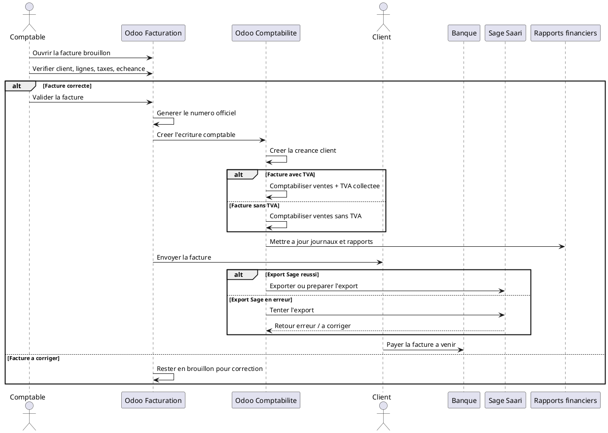

# Validation de la Facture et Impact Comptable dans Odoo 18

## 1. Introduction

La facture brouillon est un document de controle. Elle permet de verifier les lignes, les montants, la TVA, les conditions de paiement et les informations client avant toute validation definitive.

La facture validee, en revanche, devient une piece comptable officielle. C'est a cette etape qu'Odoo cree les ecritures comptables, alimente le journal de vente, reconnait la creance client et prepare le suivi du paiement.

La validation de la facture est donc une etape sensible. Une erreur a ce moment n'affecte plus seulement le circuit commercial : elle impacte directement la comptabilite, les rapports financiers et, dans le cas DigiPlus, le suivi d'export vers Sage Saari.

## 2. Point de depart

Le processus commence avec une facture client en brouillon, deja creee a partir d'une commande client confirmee.

Le workflow se lit ainsi :

```text
Commande client confirmee
-> Facture brouillon
-> Verification
-> Validation
-> Facture comptabilisee
```

La facture est donc deja prete sur le plan commercial, mais pas encore officielle sur le plan comptable.

## 3. Difference entre facture brouillon et facture validee

### Facture brouillon

La facture brouillon est :

- modifiable ;
- non comptabilisee definitivement ;
- utilisee pour la verification ;
- encore corrigeable.

Elle sert a controler le document avant qu'il ne devienne une piece officielle.

### Facture validee

La facture validee :

- devient officielle ;
- genere une ecriture comptable ;
- cree une creance client ;
- peut etre envoyee au client ;
- entre dans les rapports financiers ;
- prepare le suivi du paiement.

Le passage de brouillon a validee est donc le point de bascule entre la preparation administrative et l'impact comptable reel.

## 4. Controles avant validation

Avant de valider, plusieurs verifications sont indispensables :

- `Client correct`
- `Adresse de facturation correcte`
- `Reference de commande correcte`
- `Produits ou services corrects`
- `Quantites facturees correctes`
- `Prix unitaires conformes`
- `Remises validees`
- `TVA correcte`
- `Conditions de paiement correctes`
- `Date de facture correcte`
- `Date d'echeance correcte`
- `Journal de vente correct`
- `Compte de produit correct`
- `Compte de TVA correct`
- `Montant total coherent`
- `Statut d'export Sage Saari encore non finalise`

Ces controles permettent d'eviter qu'une erreur commerciale ou fiscale ne soit figee dans la comptabilite.

## 5. Action de validation dans Odoo

L'action utilisateur suit la logique suivante :

- ouvrir la facture brouillon ;
- verifier les informations ;
- cliquer sur `Confirmer` ou `Valider` selon l'ecran ;
- Odoo attribue un numero officiel de facture ;
- Odoo change le statut de la facture.

Le changement de statut se lit ainsi :

```text
Draft
-> Posted
```

Ce passage transforme la facture en document comptable officiel. A partir de la, le document alimente les journaux, la creance client et les rapports comptables.

## 6. Ecritures comptables generees

A la validation, Odoo genere automatiquement une ecriture comptable.

La logique comptable de base est la suivante :

### Debit

- `Compte client / creance client`

### Credit

- `Compte de vente / chiffre d'affaires`
- `Compte de TVA collectee` si applicable

### Exemple simplifie

```text
Debit
Client a recevoir : 1 180 000 FCFA

Credit
Ventes : 1 000 000 FCFA
TVA collectee : 180 000 FCFA
```

Cela signifie qu'a partir de cet instant, le client doit officiellement ce montant a l'entreprise.

## 7. Impact sur le journal de vente

La facture validee est enregistree dans le journal de vente.

Le journal de vente sert a :

- centraliser les factures clients ;
- suivre le chiffre d'affaires ;
- suivre la TVA collectee ;
- alimenter les rapports comptables ;
- servir de base au controle comptable.

Dans Odoo, les journaux de vente sont les journaux relies aux factures clients et aux ecritures de revenu associees.

## 8. Impact sur la creance client

Une facture validee cree une creance client.

Definition simple :
La creance client represente l'argent que le client doit encore payer a l'entreprise.

Apres validation, la facture reste ouverte tant que le paiement n'a pas ete enregistre ou rapproche.

Les statuts de paiement peuvent ensuite evoluer vers :

- `Non payee`
- `Partiellement payee`
- `En paiement`
- `Payee`

La facture validee existe donc comptablement avant meme que l'argent soit encaisse.

## 9. Impact sur la TVA

Si la TVA est appliquee, la validation de la facture permet de calculer et comptabiliser la TVA collectee.

Les elements a surveiller sont :

- le `taux de TVA` ;
- la `base taxable` ;
- le `montant de TVA` ;
- l'`exoneration eventuelle` ;
- la `position fiscale eventuelle` ;
- le `rapport de TVA`.

Cette etape est sensible, car une mauvaise taxe produit une mauvaise declaration fiscale et fausse les rapports.

## 10. Impact sur les rapports financiers

La facture validee alimente notamment les rapports suivants :

- `Chiffre d'affaires`
- `Journal des ventes`
- `Balance agee client`
- `Creances clients`
- `Rapport de TVA`
- `Compte de resultat`
- `Suivi des factures impayees`

Les rapports commerciaux peuvent suivre les commandes, mais les rapports comptables s'appuient surtout sur les factures validees et les ecritures associees.

## 11. Lien avec le paiement

Apres validation, la facture attend le paiement du client.

Le workflow est le suivant :

```text
Facture validee
-> Envoi au client
-> Paiement client
-> Enregistrement du paiement
-> Rapprochement bancaire
-> Facture payee
```

La validation de la facture ne signifie donc pas encore que le client a paye. Elle ouvre simplement la phase de recouvrement et de suivi d'encaissement.

## 12. Statuts de paiement

Les statuts fonctionnels a suivre sont :

- `Non payee` : aucun paiement enregistre ;
- `Partiellement payee` : une partie du montant est reglee ;
- `En paiement` : le paiement est en cours de traitement ;
- `Payee` : la facture est totalement reglee ;
- `En retard` : interpretation metier utile lorsque l'echeance est depassee sans paiement complet.

Le statut `En retard` est surtout une lecture de pilotage basee sur la date d'echeance et le solde restant.

L'interet metier de ces statuts est de :

- suivre les impayes ;
- relancer les clients ;
- preparer la tresorerie ;
- controler les creances.

## 13. Statut d'export Sage Saari

Dans le contexte DigiPlus, la facture validee peut etre preparee pour export vers Sage Saari.

Les statuts fonctionnels utiles sont :

- `Non exportee`
- `Prete a exporter`
- `Exportee`
- `Erreur d'export`
- `A corriger`

Dans votre environnement, le champ technique `x_sage_saari_export_status` porte nativement les valeurs `not_exported`, `ready`, `exported` et `error`. Le statut `A corriger` peut etre compris comme une lecture operationnelle du cas `error`, lorsqu'une action humaine est requise.

L'interet est de :

- eviter les doubles exports ;
- identifier les factures deja envoyees vers Sage ;
- reperer les erreurs de synchronisation ;
- assurer la coherence entre Odoo et Sage Saari.

## 14. Documents et traces generes

La validation produit ou met a jour les elements suivants :

- `Facture validee`
- `Numero officiel de facture`
- `PDF de facture`
- `Ecriture comptable`
- `Ligne dans le journal de vente`
- `Creance client`
- `Montant de TVA collectee`
- `Statut de paiement`
- `Historique dans le chatter`
- `Statut d'export Sage Saari` si applicable

La facture devient alors le document de reference du cycle comptable de la vente.

## 15. Tableau recapitulatif

| Etape | Acteur | Action | Document ou ecriture generee | Statut | Impact comptable | Etape suivante |
|---|---|---|---|---|---|---|
| Facture brouillon | ADV / Comptable | Ouvre la facture creee depuis la commande | Facture en preparation | `Draft` | Aucun impact definitif | Verification |
| Verification | ADV / Comptable | Controle client, lignes, taxes, dates, journal | Facture verifiee | `Draft` | Toujours non comptabilisee | Validation |
| Validation | Comptable | Clique sur `Valider` | Facture officielle | `Posted` | Debut de l'impact comptable | Numerotation |
| Numerotation | Odoo Facturation | Attribue un numero officiel | Numero de facture | `Posted` | Piece officielle identifiee | Ecriture comptable |
| Generation ecriture comptable | Odoo Comptabilite | Genere les lignes comptables | Ecriture de vente | Comptabilisee | Debit client, credit ventes et TVA | Creance client |
| Creation creance client | Odoo Comptabilite | Ouvre le montant a recevoir | Creance client | Non payee au depart | Solde client a suivre | Paiement |
| Mise a jour TVA | Odoo Comptabilite | Comptabilise la TVA collectee | Base taxable + TVA | Comptabilisee | Impact fiscal | Rapports |
| Suivi paiement | Comptable | Suit reglement et echeance | Statut de paiement | `Not Paid` / `In Payment` / `Paid` | Evolution de la creance | Banque |
| Preparation export Sage Saari | Comptable / Integration | Marque ou exporte la facture | Statut d'export | `ready` / `exported` / `error` | Synchronisation externe | Sage Saari |

## 16. Mini-workflow textuel

```text
Facture brouillon
-> Verification
-> Validation
-> Facture comptabilisee
-> Ecriture comptable
-> Creance client
-> Envoi au client
-> Paiement attendu
-> Banque / rapprochement
```

## 17. Sequence UML textuelle



## 18. Points de vigilance

Erreurs a eviter :

- valider une facture avec le mauvais client ;
- valider une facture avec une mauvaise TVA ;
- valider une facture avec une mauvaise date ;
- valider une facture sans verifier l'echeance ;
- confondre facture validee et facture payee ;
- modifier trop tard une facture deja comptabilisee ;
- exporter une facture incorrecte vers Sage Saari ;
- oublier de suivre les factures impayees ;
- ne pas rapprocher le paiement bancaire ;
- creer des doublons de facture.

## 19. Cas pratique DigiPlus

### Cas 1 : Implementation Odoo + formation utilisateurs

Client : entreprise professionnelle  
Besoin : implementation Odoo + formation utilisateurs  
Commande client : confirmee  
Facture : acompte de demarrage de 40 %

Workflow :

```text
Commande client confirmee
-> Facture d'acompte brouillon
-> Verification des lignes, TVA et conditions
-> Validation
-> Ecriture comptable
-> Creance client
-> Facture envoyee au client
-> Paiement attendu
-> Rapprochement bancaire a venir
```

Lecture fonctionnelle :

- la facture d'acompte est d'abord brouillon ;
- apres verification, elle est validee ;
- Odoo cree la creance client et la TVA si applicable ;
- la facture peut ensuite etre envoyee ;
- le paiement sera traite dans l'etape suivante.

### Cas 2 : Licence Microsoft 365

Client : PME  
Besoin : licence Microsoft 365  
Facture : licence mensuelle

Lecture fonctionnelle :

- la facture est creee sur une base periodique ou immediate selon le contrat ;
- des la validation, Odoo cree la creance client et le revenu correspondant ;
- le statut de paiement evolue ensuite selon l'encaissement effectif.

## 20. Resume operationnel

Dans Odoo 18, la validation de la facture est l'etape qui transforme une facture brouillon en document comptable officiel. Tant qu'elle est en brouillon, la facture peut encore etre corrigee. Une fois validee, Odoo lui attribue un numero officiel, cree l'ecriture comptable, ouvre la creance client et met a jour le journal de vente. Si une TVA s'applique, elle est comptabilisee a ce moment. La facture validee entre alors dans les rapports financiers et prepare le suivi du paiement. Pour DigiPlus, cette etape peut aussi inclure le suivi d'export vers Sage Saari. Il faut enfin retenir qu'une facture validee n'est pas encore forcement payee : le reglement et le rapprochement bancaire arrivent ensuite.
